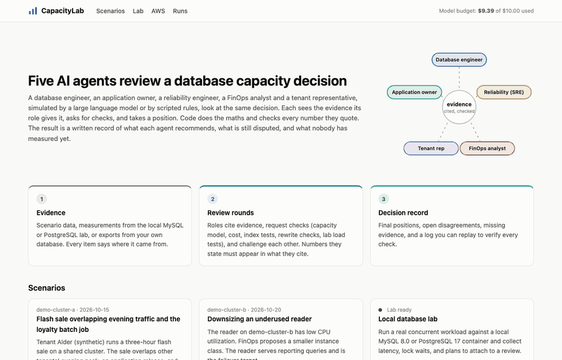
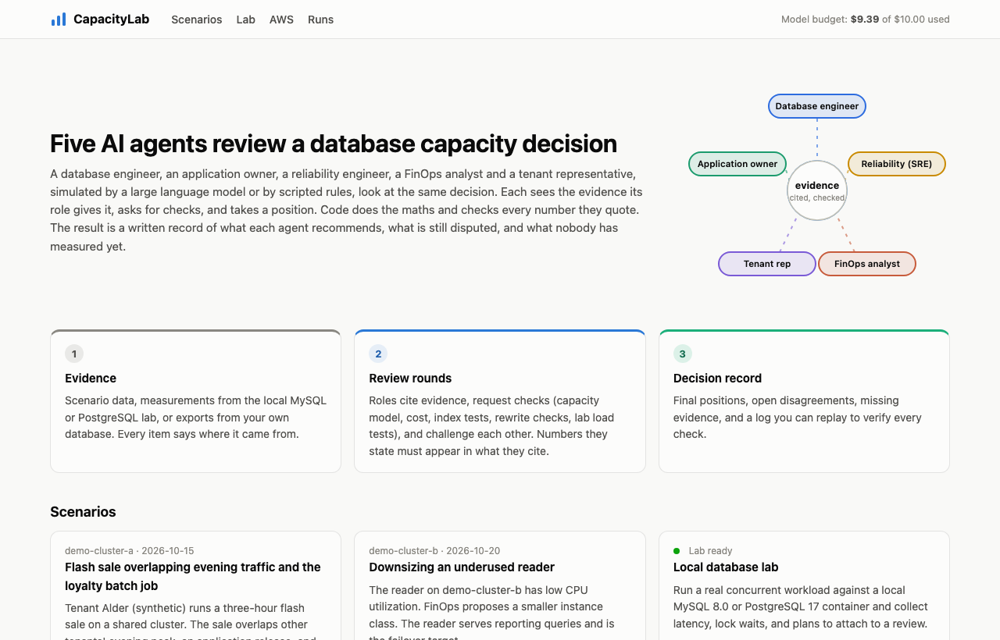
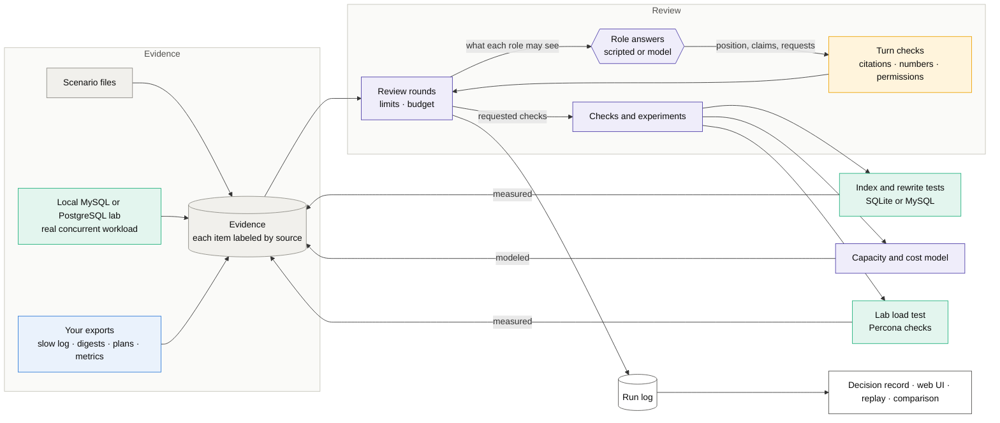

<p align="center">
  
</p>

<p align="center">
  
  
  
  
  
</p>

<p align="center">
  
  
  
  
  
  
  
  
  
  
  
  
</p>

<p align="center">
  <a href="https://github.com/cris-wendler/capacitylab/actions/workflows/ci.yml"></a>
</p>

# CapacityLab

CapacityLab runs a review of a database capacity decision by five agents (a database engineer, an application
owner, a reliability engineer, a FinOps analyst and a tenant representative) and writes down what they decided, what
they still disagree on, and what nobody has measured. The agents argue; the numbers come from deterministic code, and
every number an agent quotes is checked against the evidence it cites.

## Quickstart

You need Git and Python 3.11 or newer (`python3 --version`). No Docker, cloud account or API key.

<!-- quickstart:start -->
```bash
git clone https://github.com/cris-wendler/capacitylab.git && cd capacitylab
python3 -m venv .venv && . .venv/bin/activate
pip install -e .
capacitylab run campaign-overlap --out runs/demo.json
```
<!-- quickstart:end -->

The last step runs the full five-agent review of the `campaign-overlap` sample scenario with scripted agents. It
takes under a minute and gives the same result every time. Output of the last step:

```text
Scripted agents: the turns come from fixed rules, not a language model.
  … round 1: Database engineer
  … round 1: Application owner
  … round 1: Reliability engineer
  … round 1: FinOps analyst
  … round 1: Tenant representative (synthetic persona)
  … round 1: tool row_estimate_check
  … round 1: tool bottleneck_classifier
  … round 1: tool index_experiment
  … round 1: tool table_growth_review
  … round 1: tool batch_reschedule_check
  … round 1: tool capacity_forecast
  … round 1: tool top_queries
  … round 1: tool capacity_forecast
  … round 1: tool batch_reschedule_check
  … round 1: tool cost_estimate
  … round 1: tool tenant_skew
  … round 2: Database engineer
  … round 2: Application owner
  … round 2: Reliability engineer
  … round 2: FinOps analyst
  … round 2: Tenant representative (synthetic persona)
  … round 2: tool capacity_forecast
  … round 2: tool rewrite_equivalence
  … round 3: Database engineer
  … round 3: Application owner
  … round 3: Reliability engineer
  … round 3: FinOps analyst
  … round 3: Tenant representative (synthetic persona)
  … round 4: Database engineer
  … round 4: Application owner
  … round 4: Reliability engineer
  … round 4: FinOps analyst
  … round 4: Tenant representative (synthetic persona)
status: concluded; rounds: 4; tool calls: 13; spend: $0.0000 (0 in / 0 out tokens)
  database_engineer        OPT-INDEX-RESCHEDULE   (medium)
  application_owner        OPT-INDEX-RESCHEDULE   (medium)
  reliability_engineer     OPT-SCALE-RESCHEDULE   (medium)
  finops_analyst           OPT-INDEX-RESCHEDULE   (medium)
  tenant_representative    OPT-INDEX-RESCHEDULE   (medium)
  disagreements: 7; validation errors: 0 
ledger: runs/demo.json
report: runs/demo.md
```

`runs/demo.json` is the full record of the run and `runs/demo.md` is the same thing as a readable report.

> **The question in the demo.** A tenant is about to run a flash sale on a cluster that already runs hot in the
> evening, and a batch job starts halfway through. Scale up for the night, add an index, move the job, or a mix?

<p align="center">
  
</p>

### What the sample contains

The sample is a synthetic shared MySQL cluster (a writer and a reader, `db.r6i.16xlarge`) with five tenants, one of
which is about to run a flash sale while a batch job starts halfway through. It lives in
[`src/capacitylab/data/scenarios/`](src/capacitylab/data/scenarios/): topology, CPU and connection metrics,
statement digests, query plans, table sizes, SLOs, a rate card, a budget, tenant plans, and the batch schedule. Every
item is labelled observed, forecast, assumption, modeled or measured. A second scenario, `downsize-reader`, asks the
opposite question: whether an underused reader can be made smaller. [docs/EXAMPLE.md](docs/EXAMPLE.md) walks
through the first one in detail.

### Other things to try

```bash
capacitylab scenarios                        # list the sample scenarios
capacitylab findings campaign-overlap        # what the evidence says before any review
capacitylab validate campaign-overlap        # check a scenario and its evidence
capacitylab replay runs/demo.json            # re-run every check in the record and confirm the same results
capacitylab report runs/demo.json            # print the record as a Markdown report
capacitylab evaluate campaign-overlap        # five agents against one agent and a simple threshold rule
capacitylab serve                            # web UI at http://127.0.0.1:8765
```



## The five agents

Each agent gets a role, only the evidence that role would normally see, and a list of checks it may ask for. They
take turns over several rounds. Checks they ask for (a capacity forecast, a cost estimate, an index experiment, a
query rewrite check) run between rounds, and the results come back as new evidence.

| Agent | Looks at | Pushes for |
|---|---|---|
| 🟦 **Database engineer** | metrics, statement digests, query plans, table sizes, experiments | fixing the workload before buying capacity |
| 🟩 **Application owner** | release and event calendars, batch schedule, SLOs | keeping the sale and the release on track |
| 🟨 **Reliability engineer** | metrics, SLOs, incident and failover history | headroom, and not relying on things nobody has measured |
| 🟧 **FinOps analyst** | rate card, budget, forecast | the cheapest option that keeps the SLOs |
| 🟪 **Tenant representative** | its own plan and calendar only, with other tenants' numbers removed | what its plan guarantees it |

A run ends at the round limit, or earlier when positions stop changing. The result is a decision record: each
agent's final position and reasons, open disagreements, challenges nobody answered, and evidence nobody has.



Two kinds of agent are available. **Scripted** agents (`--provider mock`, the default) follow hand-written rules. They
are free, offline and repeatable, and they show the process, not judgment. **Language model** agents (`--provider
anthropic` or `--provider openai`) reason for themselves and cost money; see [Using a model](#using-a-model).

## What "evidence that is checked" means

Every agent turn is a structured answer: a position, and claims that each cite evidence ids. Before a turn is
accepted, code checks it:

| Check | Example of what gets flagged |
|---|---|
| The cited evidence exists | a claim citing `EV-NOPE-001`, which is not in the bundle |
| The agent is allowed to see it | the tenant representative citing another tenant's numbers |
| Every number in the claim appears in the evidence it cites | "An index cuts CPU by 63%" citing a digest that contains no 63 |
| The agent may run the check it asks for | the tenant representative asking for an index experiment |
| The position is a real option | a recommendation for an option the scenario does not have |

A flagged turn is kept, and the problem is written into the decision record where the other agents and the reader
can see it. Agents cannot add measurements; only code can (the capacity model, the cost model, the experiment
database, the lab). `tests/test_simulation.py::test_validator_flags_invented_numbers_and_bad_citations` shows each of
these checks catching a bad turn.

<p align="center">
  
</p>

In a real run with Claude Sonnet the checks caught, for example, the FinOps analyst quoting the $16,500 budget while
citing the cost estimate instead of the budget, and working out a headroom figure itself instead of quoting one.

## Using a model

```bash
pip install -e ".[anthropic]"
capacitylab run campaign-overlap --provider anthropic
capacitylab spend                            # model spend so far against your limit
```

This needs `ANTHROPIC_API_KEY` in a `.env` file (copy [`.env.example`](.env.example)). Without it the run stops
before any call and says so. Spend is capped per run and in total (`CAPACITYLAB_MAX_USD_PER_RUN` and
`CAPACITYLAB_MAX_USD_TOTAL`: $2 and $3 in `.env.example`). A two-round review of `campaign-overlap` with Claude Sonnet
cost about $2.40. Any OpenAI-compatible endpoint works too, including a free local model through Ollama; see
[docs/LLM.md](docs/LLM.md). Results of one scored run per model are in [docs/EVALUATION.md](docs/EVALUATION.md).

## Five agents against one

Five agents cost five times one agent, so CapacityLab tests whether they are worth it: the same decision runs three
ways, and a scorer that can see the scenario's hidden truth marks all three. On the flash-sale scenario, with Claude
Sonnet 5:

| | The decision | What nobody had measured | Cost |
|---|---|---|---:|
| 🟣 **Five agents** | index and move the batch job ✅ | found **both** hidden gaps, left 7 disagreements on the record | $2.85 |
| 🔵 **One agent** | index and move the batch job ✅ | found **one** of two, agreed with itself throughout | $0.64 |
| ⚪ **A threshold rule** | scale up for the evening | found **none**, never spotted the cause | **+$128.96** |

**One agent got the same answer for a quarter of the price.** The five did not find a better decision; they found more
of what nobody had measured. The rule kept the SLO but spent more, because a threshold cannot tell a heavy query from a
busy cluster. This is one run of one scenario with one model. The scored result is committed in
[docs/evaluations/](docs/evaluations/), and the method is in [docs/EVALUATION.md](docs/EVALUATION.md).

## Supported databases and clouds

| | What is supported | How it is tested |
|---|---|---|
| **Capacity and cost model** | Any database: a CPU queueing model per 15-minute slot, options priced from a rate card | Unit tests with known numbers |
| **Experiment database** | SQLite (built in, the default) or MySQL 8.0 in Docker, for index and query rewrite experiments | SQLite in CI; MySQL on request |
| **Local lab** | MySQL 8.0 and PostgreSQL 17 in Docker, optionally with Percona Toolkit. See [docs/LAB.md](docs/LAB.md) | In the Containers workflow, run on request |
| **File imports** | MySQL slow log, `performance_schema` digest export, `EXPLAIN ANALYZE`, CloudWatch JSON, Percona Toolkit reports. See [docs/IMPORTS.md](docs/IMPORTS.md) | Synthetic sample files in CI |
| **AWS** | RDS and Aurora: topology, CloudWatch metrics, on-demand prices, cost this month | Recorded API responses in CI; the Floci emulator on request |
| **Google Cloud** | Cloud SQL: topology and metrics. No prices or cost | Recorded API responses in CI; the floci-gcp emulator on request |
| **Azure** | Database for MySQL or PostgreSQL flexible server: topology, metrics, prices, cost | Recorded API responses in CI; the floci-az emulator (topology only) on request |

Cloud imports are read-only, talk to a local emulator unless you pass `--live`, and store no account ids, names or
endpoints.

## Limitations

- **Databases only.** The scope is deliberate: the checks go deep on query plans, indexes, buffer pool against
  working set, and tenants sharing one schema.
- **Scripted agents follow fixed rules.** They show the process, not judgment. Comparisons that use them test the
  code, not how a model decides.
- **The capacity model is a CPU queueing approximation of one node.** It does not model I/O, buffer pool behaviour,
  replication or connection pools. Working-set risk is flagged, not estimated.
- **Concurrency is measured, not modelled.** Connections are imported and the lab records lock waits and deadlocks,
  but the model does not know `max_connections` or pool sizes.
- **The scenarios are hand-written.** Workload shape, statement mix and tenant split are typed in, not derived from
  imported data. Everything in the samples is synthetic.
- **Cloud imports have never been run against a real account**, only against recorded responses and local
  emulators. Prices are on-demand list prices, without reserved instances or savings plans. Each import reads one
  instance and its readers.
- **The lab is small.** A synthetic dataset on one container. Rare statements get few samples. It supports only the
  `campaign-overlap` statements.
- **A saved run replays on the machine that recorded it.** The experiments measure work by counting steps inside
  the database engine, and engine versions count differently, so replaying someone else's run on a different SQLite
  or MySQL version reports differences. Replay names both versions when they differ.
- **Imported files are redacted for emails and IPv4 addresses only.** Check them before sharing a run record.
- **Real model runs are not committed as replayable records**, only their scores ([docs/evaluations/](docs/evaluations/)).
  The OpenAI-compatible provider has been tested against recorded responses, not a live endpoint.
- **Five agents against one has been measured once**, on one scenario with one model. One agent reached the same
  decision for a quarter of the cost; the five raised more of the gaps nobody had measured.
- Not done yet: deriving the scenario and the instance plan from imported history, alerting, treating connection
  limits as a constraint, naming the service that owns a query, and comparing a decision with what happened after.

## More documentation

- [docs/EXAMPLE.md](docs/EXAMPLE.md): the flash-sale scenario in detail, with the numbers and where each comes from
- [docs/HOW-IT-WORKS.md](docs/HOW-IT-WORKS.md): the review loop, evidence labels, and what each agent sees
- [docs/LLM.md](docs/LLM.md): model providers, Ollama, costs, and the recorded real runs
- [docs/EVALUATION.md](docs/EVALUATION.md): five agents against one agent and a rule, and how it is scored
- [docs/LAB.md](docs/LAB.md), [docs/IMPORTS.md](docs/IMPORTS.md), [docs/CONFIGURATION.md](docs/CONFIGURATION.md)
- [CHANGELOG.md](CHANGELOG.md)

## Development

```bash
pip install -e ".[dev]"
python -m pytest                             # needs no Docker, network or key
ruff check src tests scripts
capacitylab scan                             # checks the tree for leftover real names; must report 0 findings
```

`tests/test_readme_commands.py` runs every `capacitylab` command in this README, and checks that the commands in
`docs/` are real commands with real flags (they need Docker, a cloud or a key, so they are not executed). CI runs the
quickstart exactly as written. [CONTRIBUTING.md](CONTRIBUTING.md) covers the container suites and the house rules;
`scripts/capture_media.py` regenerates the screenshots in `docs/media` and is only for maintainers. Security problems
go through [SECURITY.md](SECURITY.md).

## Built on

MySQL, PostgreSQL, SQLite, Percona Toolkit, FastAPI, Pydantic, Uvicorn, Jinja, pytest and ruff; the Floci, floci-gcp
and floci-az emulators for cloud tests; Ollama for free local model runs.

## License

[AGPL-3.0-or-later](LICENSE). If you run a modified version as a network service, the AGPL asks you to publish your
changes; set `CAPACITYLAB_SOURCE_URL` and the web UI links to your source. A commercial license is available from
the author ([@cris-wendler](https://github.com/cris-wendler)). MySQL, PostgreSQL, Percona Toolkit and the emulators run
from their own Docker images under their own licenses and are not included here.
