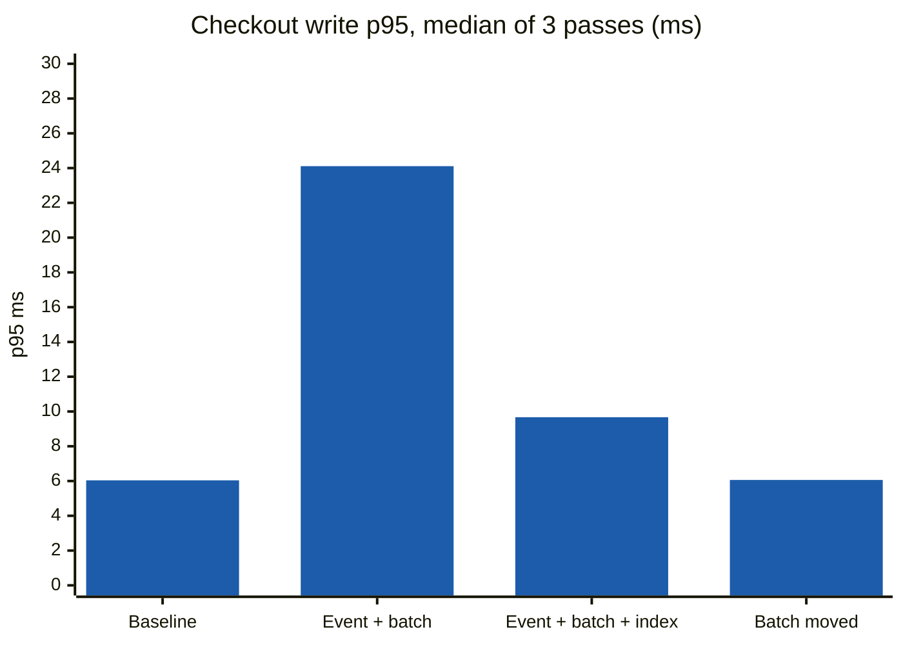
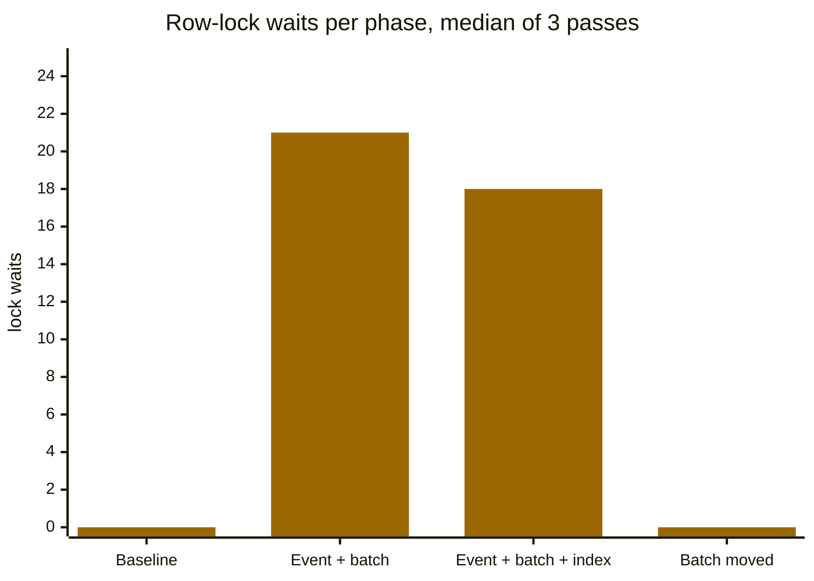
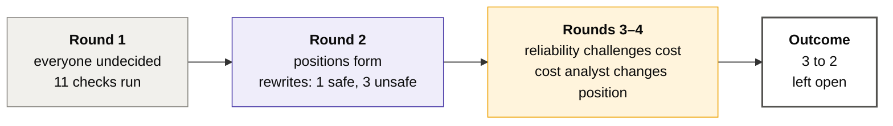
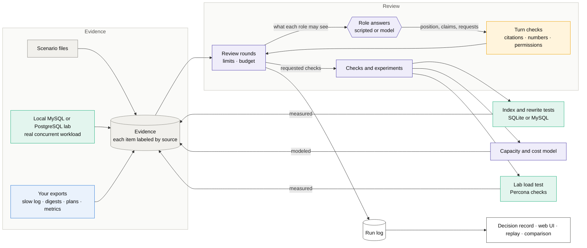
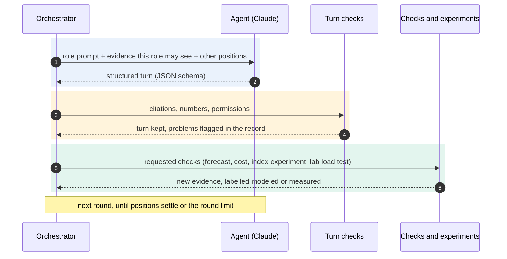
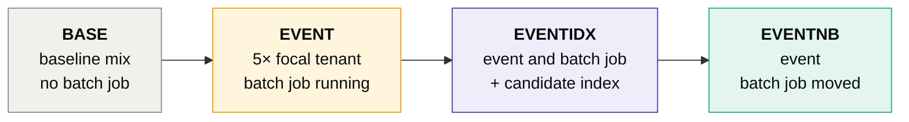

<p align="center">
  
</p>

<p align="center">
  
  
  
  
  
</p>

<p align="center">
  
  
  
  
  
  
  
  
  
  
</p>

<!-- Add the CI badge once the repository is public:
[](https://github.com/<owner>/capacitylab/actions/workflows/ci.yml) -->

# CapacityLab

**CapacityLab is a multi-agent LLM simulation for database capacity planning, reliability and FinOps decisions.**
Five agents built on Claude play the people who normally argue about a busy database: a database engineer, an
application owner, a reliability engineer (SRE), a FinOps analyst and a tenant representative. They read the same
evidence, take turns over several rounds, ask for checks, and finish with a decision record: what was decided, what
is still disputed, and what nobody has measured.

The agents do the arguing. The maths is done in code: the queueing model, costs, lab measurements and query
experiments are deterministic Python, and every number an agent states is checked against the evidence it cites.

> **The question in the demo.** A tenant is about to run a flash sale on a cluster that already runs hot in the
> evening, and a batch job starts halfway through. Scale up for the night, add an index, move the job, or a mix?

<p align="center">
  
</p>

> [!NOTE]
> Every scenario, tenant, cluster and figure in this repository is synthetic. Local lab measurements compare phases
> with each other; they do not predict production latency.

## Contents

| Start here | Go deeper | Reference |
|---|---|---|
| [Tech stack](#tech-stack) | [How a review runs](#how-a-review-runs) | [Configuration](#configuration) |
| [The five agents](#the-five-agents) | [Using Claude for the agents](#using-claude-for-the-agents) | [Project layout](#project-layout) |
| [What you get](#what-you-get) | [The local database lab](#the-local-database-lab) | [Status and limitations](#status-and-limitations) |
| [Example: a flash sale meets a batch job](#example-a-flash-sale-meets-a-batch-job) | [Bringing your own data](#bringing-your-own-data) | [Next](#next) |
| [Quick start](#quick-start) | [Comparison with simpler approaches](#comparison-with-simpler-approaches) | [License](#license) |

---

## Tech stack

| Layer | Built with | What it does here |
|---|---|---|
|  | Claude Opus 5 and Sonnet 5 through the Anthropic Python SDK | Each agent's turn is one Messages API call that returns JSON matching a Pydantic schema (structured outputs). Prompt caching on the evidence block, token counting before every call, reasoning effort set per role, one retry when a turn is cut off. |
|  | Plain Python, no agent framework | Rounds, what each role is allowed to see, checks requested between rounds, stopping when positions settle, and a run log that can be replayed. |
|  | Turn validation in code | Citations must exist and be visible to the role, every number must appear in the cited evidence, requested checks must be allowed for the role, spend must fit the limits. |
|  | M/M/c queueing model | CPU utilisation per 15 or 60 minute slot, SLO breach slots, instance options scored against each other. |
|  | Cost model and tenant entitlements | Option costs from the scenario's rate card, spend limits for the model itself, each tenant's CPU share against what its plan guarantees. |
|  | MySQL 8.0 and PostgreSQL 17 in Docker, SQLite, Percona Toolkit | Concurrent load tests, `performance_schema` and `pg_stat_statements`, `EXPLAIN ANALYZE` and `EXPLAIN (ANALYZE, BUFFERS)`, index and rewrite experiments, `pt-query-digest` and friends. |
|  | FastAPI, Jinja, SVG charts, argparse | Web UI for scenarios, runs, lab results and comparisons; the same features on the command line. |
|  | pytest, ruff, GitHub Actions | Unit and end-to-end tests, MySQL and PostgreSQL jobs in CI, replay of a full run, and a scan for leftover identifiers. |

## The five agents

Each agent gets a role, the evidence that role would normally see, and a list of checks it may ask for. None of
them sees everything.

| Agent | Looks at | Can ask for | Reasoning effort |
|---|---|---|:---:|
|  | metrics, statement digests, plans, schema, table stats, forecast, batch schedule, experiments | top queries, tenant skew, plan review, index experiment, rewrite check, row-estimate check, table growth, bottleneck check, capacity forecast, lab load test, redundant-index check | low |
|  | calendars, releases, batch schedule and history, SLOs, digests, tenant profiles | top queries, batch reschedule check, capacity forecast, cost | low |
|  | metrics, forecast, SLOs, incident and failover history, calendars, batch, experiments | tenant skew, bottleneck check, batch reschedule check, capacity forecast, cost, lab load test | medium |
|  | metric summary, forecast, rate card, budget, table stats, experiments | tenant skew, table growth, capacity forecast, cost | low |
|  | its own profile, calendar and SLOs, and model results with other tenants removed | tenant skew (own share only), capacity forecast | low |

Roles that mostly quote measurements run at low effort so their answers stay close to the numbers. The reliability
engineer, who has to weigh an unmeasured failover against headroom and cost, gets more room. The same roles can also
run from scripted rules, which is free, offline and repeatable.

<p align="center">
  
</p>

## What you get

| | |
|---|---|
| 📝 **A decision record** | What each agent recommends and why, open disagreements, unanswered challenges, evidence nobody has, and checks that were requested but never ran. |
| 🩺 **Findings before any review** | Whether a node runs out of CPU or is oversized, whether failover has ever been measured, which tables grow in a way that hurts, and which statements one tenant dominates. `capacitylab findings <scenario>` or the scenario page. |
| 🧪 **Measurements from a real engine** | A local MySQL 8.0 or PostgreSQL 17 lab runs the scenario's statement mix over many connections and records latency percentiles, lock waits, deadlocks, statement digests and plans, optionally with Percona Toolkit. |
| 💸 **Costs next to the risk** | Every option priced from the scenario's rate card, and each tenant's share of the cluster compared with what it pays for. |
| 📥 **Your own data** | Import slow logs, `performance_schema` digest exports, `EXPLAIN ANALYZE` output, CloudWatch metrics and Percona Toolkit reports. |
| 🔁 **Replay** | Every item is labelled observed, forecast, assumption, modeled or measured. Every run is a log you can replay to re-check each result. |

---

## Example: a flash sale meets a batch job

The `campaign-overlap` scenario: Tenant Alder runs a sale from 18:00 to 21:00 on `demo-cluster-a` (writer
`db.r6g.2xlarge`). Other tenants peak at the same time, a release raises order-history traffic, and the loyalty
recalculation job starts at 19:00.

```mermaid
gantt
  title The evening on demo-cluster-a
  dateFormat HH:mm
  todayMarker off
  axisFormat %H:%M
  section Traffic
    Release 2.14 raises order history   :active, rel, 14:00, 10h
    Other tenants' evening peak         :peak, 18:00, 3h
  section Alder
    Flash sale, 5x planned (3.1x last time) :crit, sale, 18:00, 3h
  section Batch
    Loyalty recalculation, 90 min       :crit, batch, 19:00, 90m
  section Scale-up option
    4xlarge window, 2 failovers          :done, scale, 16:00, 7h
```



> [!IMPORTANT]
> The tenant expects 5× traffic, but its last sale peaked at 3.1×. CapacityLab flags the conflict instead of picking
> one, and makes the planning value (5×) an explicit assumption every role can see and challenge.

### The assumptions it rests on

Every number the model leans on without a measurement is written down, with what it is based on. Roles can ask for a
forecast with any of them changed.

| Assumption | Value | Why it is an assumption | Based on |
|---|---:|---|---|
| `A-CAMPAIGN-MULT` | 5.0× | The tenant's stated expectation for the sale; its last comparable sale peaked at 3.1× | tenant profile, event calendar |
| `A-RELEASE-MULT` | 1.3× | Estimated effect of release 2.14 on order-history calls | release calendar |
| `A-CPU-ROWS-EXPONENT` | 0.8 | Turns work saved in a local experiment into production CPU; never measured | nothing measured |
| `A-PROD-ORDERS-ROWS` | 7,200,000 rows | Production size of `orders`, used to extrapolate index size | table statistics |
| `A-FAILOVER-SECONDS` | unknown | Writer failover time during an instance change; never measured on this cluster | nothing measured |
| `A-BUFFER-POOL-FRACTION` | 0.75 | Buffer pool share of instance memory in `downsize-reader`; common default, parameter group not checked | nothing measured |

### Who gets the capacity

On a shared cluster, a sale is not only a capacity question; it is a question of who is entitled to the capacity there
is. Each tenant's plan is evidence (tier, contract value, the CPU share it guarantees; synthetic here), and CapacityLab
compares it with the CPU share each tenant's workload takes, modeled from calls per second and CPU per call:

| Tenant | Plan | Guaranteed | Normal evening | During Alder's sale (5×) |
|---|---|---:|---:|---:|
| Alder | premium | 35% | 42.5% |  |
| Birch | standard | 20% | 23.0% |  |
| Cedar | standard | 20% | 16.4% |  |
| Dune | standard | 15% | 11.1% |  |
| Elm | basic | 10% | 7.0% |  |

*Over* means more than 125% of the guaranteed share; *squeezed* means less than 60% of it.

> [!IMPORTANT]
> The burst has to come from somewhere. Either Alder's plan covers capacity for announced events, capacity is bought
> for the window, or the guaranteed shares of the other four tenants absorb it. CapacityLab reports the levers that
> exist and their limits rather than pretending a governor is in place: per-tenant limits in the application's
> connection pool (with a shared schema the database usually cannot tell tenants apart), MySQL 8.0 resource groups
> for thread priority where the engine supports them (managed MySQL variants may not), or capacity for the window.

The review is available to the application owner, reliability engineer and cost analyst as
`tenant_entitlement_review`; the tenant representative sees only its own plan.

### What the capacity model says

From the scripted run, with the index effect measured in the SQLite experiment database:

| Option | Peak CPU | Slots over 80% | SLO breach slots | One-off cost |
|---|---:|---:|---:|---|
| Keep capacity | 115.0% | 12 |  | $0 |
| Scale to 4xlarge, 16:00–23:00 | 57.5% | 0 |  | $16.80, plus 2 writer failovers of unknown length |
| Add the index | 97.7% | 8 |  | $0 |
| Move the batch job to 01:00 | 95.0% | 11 |  | $0 |
| Index and move the batch job | 77.7% | 0 |  | $0.01/month storage |
| Scale up and move the batch job | 47.5% | 0 |  | $16.80, plus failovers |

Prices come from the scenario's own rate-card evidence (`EV-RATE-001`), not from code: the cost model reads it from
the evidence bundle, and a scenario without one fails validation. The numbers shipped here are illustrative and
labelled as an assumption, so replacing that one evidence item with your provider's rates re-prices every option.


The chart above comes from the three-round review with Claude Sonnet, not the scripted run. Its index options show no
benefit because that run's database engineer measured a different index (`tenant_id, customer_id, created_day`, 16.7%
less work) from the one those options propose; with no measurement for the proposed index, the model credits it with
nothing. The table above comes from the scripted run, which measured the proposed index.

### What the lab measured

`capacitylab lab run campaign-overlap --repeats 3 --percona` on MySQL 8.0.46 in a local container: 16 connections,
30 seconds per phase, three passes over the whole phase set, each with its own seed. Bars and table values are the
median of the three passes; ± is the spread across them, as a share of the median.





| p95 latency | Baseline | Event with batch job | Event, batch job, index | Event, batch job moved |
|---|---:|---:|---:|---:|
| Checkout write | 6.04 ms ±18% | **24.11 ms ±140%** | 9.67 ms ±209% | **6.06 ms ±2%** |
| Campaign audience query | too few calls | 15.40 ms ±6% | **8.14 ms ±33%** | 15.85 ms ±11% |
| Order history | 1.94 ms ±11% | 2.16 ms ±7% | 2.13 ms ±4% | 2.04 ms ±3% |
| Row-lock waits | 0 | 21 | 18 | **0** |
| Database load (active sessions) | 0.017 | 0.132 | 0.117 | 0.031 |

> [!TIP]
> **The batch job's row locks drive checkout latency here.** Moving it takes checkout p95 from 24.11 ms to 6.06 ms and
> lock waits from 21 to 0, in every pass. That phase varies by only ±2%, far less than the difference, so the result
> holds rather than being a lucky run.

> [!NOTE]
> **The index does help the audience query.** Its p95 goes from 15.40 ms to 8.14 ms, and the passes do not overlap:
> the worst indexed pass (9.11 ms) still beats the best unindexed one (14.81 ms). Rows examined per call drop from
> 10,886 to 7,635. With only 7–9 audience calls per phase, treat this as indicative, not settled.

> [!WARNING]
> **What this lab cannot answer: what the index does to checkout writes.** In the two phases where the batch job runs,
> checkout p95 varies by ±140% and ±209% across passes, more than the difference between the phases. Earlier
> single-pass runs seemed to show the index making checkout worse; repeating the passes showed that was noise. This is
> why one run per phase is not enough, and why `--repeats` exists.

#### The same phases on PostgreSQL 17

`capacitylab lab run campaign-overlap --engine postgres --repeats 3` on PostgreSQL 17.11: the same dataset, seeds,
connections and phase length.

| p95 latency | Baseline | Event with batch job | Event, batch job, index | Event, batch job moved |
|---|---:|---:|---:|---:|
| Checkout write | 5.37 ms ±23% | 12.59 ms ±132% | 36.97 ms ±134% | **5.25 ms ±9%** |
| Campaign audience query | too few calls | 5.70 ms ±26% | **2.90 ms ±39%** | 3.69 ms ±24% |
| Order history | 1.77 ms ±9% | 1.63 ms ±32% | 1.73 ms ±9% | 1.64 ms ±12% |
| Lock waits (session-seconds) | 0 | 2.3 | 2.6 | **0** |
| Database load (active sessions) | 0.002 | 0.101 | 0.098 | 0.004 |

<table>
<tr>
<td width="50%" valign="top">

**Where the engines agree.** Moving the batch job clears lock waits in every pass on both engines, and checkout
p95 returns to baseline (5.25 ms, ±9%). Database load drops from about 0.1 active sessions to 0.004.

</td>
<td width="50%" valign="top">

**Where they differ.** PostgreSQL recorded no deadlocks; MySQL did. With the batch job running, PostgreSQL checkout p95
varies even more (±132%, ±134%), so the index's effect on writes stays unanswered here too.

</td>
</tr>
</table>

> [!NOTE]
> On PostgreSQL the index also speeds up the audience query while the batch job runs: the slowest indexed pass
> (3.58 ms) beats the fastest unindexed one (5.31 ms). But with the batch job moved and no index, the query already
> runs at 3.22–4.10 ms. With 7–9 calls per phase, the lab cannot yet separate the index's benefit from the batch job's
> cost.

> [!IMPORTANT]
> PostgreSQL keeps no cumulative lock-wait counter. Lock waits here come from sampling `pg_stat_activity` every
> 0.1 s, so they are session-seconds rather than a count of waits, and they are not comparable with the MySQL row.


### What the agents concluded

With scripted roles and the lab file attached (`capacitylab run campaign-overlap --evidence runs/lab/campaign-overlap-lab.yaml`).
The runs with Claude are [further down](#runs-with-a-real-model).



-  The database engineer points to the audience query (96.2% of rows examined; the plan estimated 1,800
  rows and read 2,400,000). The application owner requests a sensitivity forecast at 3.1× because the sources disagree.
-  `IN → EXISTS` returns identical results on all 15 fixture cases at 29% of the work. `IN → JOIN` returns
  duplicate rows. `NOT IN → NOT EXISTS` changes the results for Tenant Cedar because of NULLs, so it is a behavior
  change, not an optimization. Dropping the tenant filter leaks rows across tenants.
-  Moving the batch job alone still peaks at 95% against an 80% threshold, so the cost analyst changes
  position. The database engineer and the reliability engineer both cite the lab, including the checkout regression
  the index showed in that single-pass run. Three later passes put that regression inside the run-to-run noise, which
  is exactly the trap `--repeats` exists to catch.
-  Database engineer, application owner, and cost analyst: index and move the batch job. Reliability
  engineer and tenant representative: scale up and move the batch job, for more headroom while the index benefit is
  unproven. Still missing: failover duration, a production-like test of the index, and whether the audience query can
  run on the reader.


*Screenshots of runs are from the three-round review with Claude Sonnet described [below](#runs-with-a-real-model),
where every role converged; the rounds above describe the scripted run, which split 3–2.*

> [!NOTE]
> The scripted roles cite the lab numbers, but their choice rules do not weigh them against the capacity model. A
> careful reviewer given the same evidence might reasonably prefer moving the batch job alone plus a contingency plan.

<details>
<summary><b>A database change proposal, and the second scenario</b></summary>

Every proposed index or rewrite must include evidence, why it should help and how sure we are, the change, tradeoffs
(write overhead, storage), how to validate it, how to roll it back, and the result so far.


`downsize-reader` covers the opposite question. CPU would allow a smaller reader, but its working set (71 GiB) is
larger than the smaller instance's modeled buffer pool, and the reader is the failover target. Four roles keep the
reader; the cost analyst holds out for a smaller one.

</details>

---

## How a review runs



Each round, every agent receives only the evidence its role gives it, plus the other agents' latest positions and
challenges. It returns a structured turn: a position, claims with cited evidence ids, assumptions, challenges, missing
evidence and requests for checks. The requested checks run between rounds, and their results arrive as new evidence in
the next one. A run stops at the round limit, or earlier when positions stop changing and nothing is left unanswered.



**Evidence labels.** Each item carries one of five labels, with the same colors as the web UI:

| Label | Meaning |
|---|---|
|  | Collected from a system, or scenario data standing in for it |
|  | Projected from stated assumptions |
|  | Stated, not measured (for example the tenant's 5× expectation) |
|  | Output of the capacity or cost model |
|  | Measured by an experiment CapacityLab ran, in the local lab or experiment database |

Each item also records where it came from: scenario data, the local lab, or an imported file.

> [!CAUTION]
> The experiment database and both labs only connect to `localhost` and only to databases named
> `capacitylab_sandbox…`. Percona Toolkit only attaches to containers named `capacitylab-*`. Nothing in CapacityLab
> connects to a cloud account.

---

## Quick start

Requires Python 3.11+. Docker is only needed for the labs.

```bash
python3.11 -m venv .venv && source .venv/bin/activate
pip install -e ".[dev,anthropic,mysql]"
cp .env.example .env
```

<table>
<tr>
<th width="33%">🆓 Scripted agents, no key</th>
<th width="33%">🤖 Claude agents</th>
<th width="33%">🧪 With the lab attached</th>
</tr>
<tr>
<td valign="top">

```bash
capacitylab findings campaign-overlap
capacitylab run campaign-overlap \
  --provider mock --out runs/demo.json
capacitylab replay runs/demo.json
```

Free, offline, the same every time.

</td>
<td valign="top">

```bash
# ANTHROPIC_API_KEY in .env
capacitylab run campaign-overlap \
  --provider anthropic --max-rounds 3
capacitylab spend
```

About $1–2 for three rounds; the run stops at your limit.

</td>
<td valign="top">

```bash
docker compose up -d --wait sandbox-mysql
capacitylab lab run campaign-overlap \
  --repeats 3 --out runs/lab/c.yaml
capacitylab run campaign-overlap \
  --evidence runs/lab/c.yaml
```

Real latency, lock waits and plans as evidence.

</td>
</tr>
</table>

`capacitylab serve` opens the web UI at http://127.0.0.1:8765 with all of the above as pages.

<details>
<summary><b>Running the tests</b></summary>

```bash
python -m pytest                           # everything that needs no database server
ruff check src tests scripts

docker compose up -d --wait sandbox-mysql
CAPACITYLAB_TEST_MYSQL=1 python -m pytest -m mysql

pip install -e ".[postgres]"
docker compose up -d --wait sandbox-postgres
CAPACITYLAB_TEST_POSTGRES=1 python -m pytest -m postgres
```

</details>

---

## The local database lab

```bash
docker compose up -d --wait sandbox-mysql
capacitylab lab run campaign-overlap --duration 60 --qps 300 --out runs/lab/campaign.yaml
capacitylab run campaign-overlap --evidence runs/lab/campaign.yaml --sandbox mysql
```

Or use the **Lab** page in the web UI, which also picks the engine. Each run loads the synthetic retail dataset (122,675 orders, 4,000 customers
across five tenants) into a disposable database and replays the same seeded Poisson arrivals through four phases:



| Collected per phase | MySQL 8.0 | PostgreSQL 17 (`--engine postgres`) |
|---|---|---|
| Client latency p50 / p95 / p99 and queueing delay | the workload driver, per call | the same driver |
| Statement statistics mapped to scenario statements | `performance_schema` digests: rows examined, temporary tables | `pg_stat_statements`: buffer blocks, blocks read from disk |
| Lock waits and deadlocks | `SHOW GLOBAL STATUS`, `INNODB_METRICS` | sampled `pg_stat_activity`, `pg_stat_database` |
| Running sessions and database load | `Threads_running`, sampled | active sessions, sampled |
| Plans with estimated and actual rows | `EXPLAIN ANALYZE` | `EXPLAIN (ANALYZE, BUFFERS, FORMAT JSON)`, with blocks per step |

```bash
pip install -e ".[postgres]"
docker compose up -d --wait sandbox-postgres
capacitylab lab run campaign-overlap --engine postgres --repeats 3 --out runs/lab/campaign-pg.yaml
```

Both engines produce the same evidence ids, so a review can use either file. Percona Toolkit checks apply to the MySQL
lab only.

Percentiles based on fewer than 20 calls are marked *low sample*. With `--sandbox mysql`, roles can also request a
two-phase `lab_load_test` during a review.

### Repeating the phases

```bash
capacitylab lab run campaign-overlap --repeats 3 --out runs/lab/campaign.yaml
```

One pass gives one number per phase, and numbers move between runs. `--repeats N` runs the whole phase set N times,
each pass with its own seed, and adds an `EV-LAB-SPREAD` item with the median, minimum, maximum and range per phase
for statement p95, lock waits, deadlocks and database load. Detailed evidence comes from the first pass, and Percona
checks run only there.

> [!TIP]
> A difference between phases only means something if it is larger than the range within a phase. This is how the
> index question below is meant to be settled.

### Percona Toolkit

```bash
docker pull percona/percona-toolkit
capacitylab lab run campaign-overlap --percona --out runs/lab/campaign-percona.yaml
```

With `--percona` (or the checkbox on the Lab page), each tool runs from the official image in a throwaway container
that shares the lab container's network, so it can reach only the lab server.

| Tool | When | What becomes evidence |
|---|---|---|
| `pt-query-digest` | every phase, on a slow log recorded with `long_query_time=0` | calls, share of query time, p95, rows examined and lock time per statement |
| `pt-duplicate-key-checker` | while the candidate index exists | indexes made redundant (duplicate or left prefix) and their size |
| `pt-deadlock-logger` | after the last phase | the latest deadlock: statements, tables, indexes, lock modes, which transaction was rolled back |
| `pt-variable-advisor`, `pt-mysql-summary` | before the first phase | warnings about server settings, labeled as describing the lab container |


> [!TIP]
> Against the lab, `pt-duplicate-key-checker` reports that the alternative candidate (`tenant_id, customer_id,
> created_day`) makes the existing `idx_orders_tenant_customer` a redundant left prefix (about 1 MiB here), and
> `pt-deadlock-logger` caught a deadlock between a checkout write and the batch job.

> [!NOTE]
> Logging every statement slows all phases a little, so compare phases within a `--percona` run, not against runs
> without it. InnoDB keeps only the latest deadlock, so per-phase deadlock counts come from its own counter. Slow log
> files are deleted from the container after each phase.

---

## Bringing your own data

```bash
capacitylab import slowlog mysql-slow.log --tenant-map 1=alder,2=birch --out runs/imports/mine.yaml
capacitylab import pt-query-digest digest.json --out runs/imports/mine.yaml
capacitylab run campaign-overlap --evidence runs/imports/mine.yaml
```

| Kind | Input | Notes |
|---|---|---|
| `slowlog` | MySQL slow query log | grouped by fingerprint with literals removed; per-tenant counts by tenant column (`--tenant-map`) or schema (`--schema-map`) |
| `digest` | performance_schema digest export, CSV or JSON | `--window-seconds` for rates |
| `plan` | `EXPLAIN ANALYZE` output | `--fingerprint` names the statement |
| `metrics` | JSON from `aws cloudwatch get-metric-statistics` | `--unit`, `--period` |
| `pt-query-digest` | `pt-query-digest --output json` | statements keep the tool's checksum id (`PT-…`) |
| `pt-duplicate-keys` | `pt-duplicate-key-checker` text | |
| `pt-deadlocks` | `pt-deadlock-logger --tab` | client addresses are dropped |

> [!WARNING]
> Emails and IPv4 addresses are removed on import, and nothing else. Check imported files before sharing a run log.

File names are never stored. They often carry host, customer or person names, and evidence text reaches the model's
context and the run report. An import is named by a short hash of its contents, so the same file always gets the same
id, or by a name you choose: `capacitylab import slowlog peak.log --label "evening peak" --out ...`.

---

## Using Claude for the agents

Put your key in `.env` (git-ignored) and set the total you are willing to spend:

```bash
ANTHROPIC_API_KEY=...               # a key created inside a workspace
CAPACITYLAB_MAX_USD_TOTAL=3.00
```

```bash
capacitylab run campaign-overlap --provider anthropic --max-rounds 3 --evidence runs/lab/campaign.yaml
capacitylab spend
```

Claude receives the same evidence and rules as the scripted roles and must return the same structured turn. Spend is
recorded in `runs/spend-ledger.json`.

<table>
<tr>
<th width="50%">✍️ Claude writes</th>
<th width="50%">⚙️ Code computes</th>
</tr>
<tr>
<td valign="top">

- each agent's position and the reasons for it
- claims, each citing evidence ids
- challenges to other agents
- assumptions it relies on and evidence it is missing
- requests for checks and experiments

</td>
<td valign="top">

- statement digests, query plans, lock waits, deadlocks
- the queueing model and option scoring
- costs and tenant entitlements
- index and rewrite experiments, lab load tests
- the checks on every turn, and the spend limit

</td>
</tr>
</table>

An agent cannot add a measurement, only reason about the ones on the table. A number in a claim that does not appear in
the evidence the claim cites is flagged in the decision record, where the other agents and the reader can see it.

**Reasoning effort, not temperature.** These models take an effort setting rather than a temperature. With
`CAPACITYLAB_EFFORT=auto` (the default) each agent gets the effort shown in [the five agents](#the-five-agents);
`low`, `medium` or `high` applies one value to every role.

> [!IMPORTANT]
> Before each call, CapacityLab counts the tokens it is about to send and prices the worst case (the full context
> plus the maximum output). If that would cross the per-run or total limit, the run stops first. A turn cut off at the
> output limit is retried once with a request for a shorter answer; both attempts are charged.

Each role's pack is sent in two parts: a first part that only grows by appending (scenario header, then one evidence
item per line, with check results last) and a small second part with this round's state. The first part is marked for
caching, so a later round re-sends only what is new. In a three-round `campaign-overlap` review, 46–88% of that block
is unchanged from the role's previous round. Nothing is left out of the pack, since each call starts with no memory of
earlier rounds.

Rough cost of a full review, using the live run's average turn length and the prices in `.env.example`:

| Rounds | Model | Estimated cost |
|---:|---|---:|
| 2 | Sonnet | $0.74 |
| 2 | Opus | $1.24 |
| 3 | Sonnet | $1.09 |
| 3 | Opus | $1.81 |

Output is more than half of it, so the rest depends on how long the turns are, not on how much evidence is attached.

### Runs with a real model

Two runs so far on `campaign-overlap` with the lab file attached:

| | Opus, 2026-09-15 | Sonnet, 2026-09-16 |
|---|---|---|
| **Outcome** |  9 of 15 turns |  15 turns |
| **Cost** | $1.94 | $2.28 |
| **Outcome of the review** | 3–2 split: index and move the batch job, against scale up and move it | all five roles: move the batch job |
| **Violations caught** | 8 (plus 3 checker mistakes, since fixed) | 4, all in round 1 |

- **The two models disagreed about the answer.** Opus split 3–2, as the scripted roles do. Sonnet converged: after the
  forecasts arrived, its database engineer moved to "index and move the batch job" in round 2, then back to "move the
  batch job" in round 3, and the others followed. Unanimity is not agreement about truth; both runs used the same
  evidence. Both also predate the three-pass lab run, which supports an audience-query benefit from the index but
  cannot resolve what it does to checkout writes.
- **What the checks caught in the Sonnet run:** two numbers quoted from the scenario summary instead of from cited
  evidence, one proposal marked as measured without citing an experiment, and one role citing a gap id as if it were
  evidence. The prompt now addresses the last two directly.
- **One turn hit the output limit** and was retried with a request for a shorter turn, which saved the run. Both
  attempts were charged.
- **Round 1 costs almost nothing in input** because the whole pack is written to the cache; rounds 2 and 3 re-send
  only what is new.

---

## Comparison with simpler approaches

`capacitylab evaluate <scenario>` gives the same evidence to the five-role review, a single reviewer with all evidence
and all checks, and simple capacity rules. It then scores each recommendation inside the capacity model using
assumptions no role saw (for example the real multiplier, 4.2×).

| Scenario | Approach | Recommendation | Extra breach slots | Extra cost | Root cause found | Known gaps raised |
|---|---|---|---:|---:|:---:|---:|
| campaign-overlap | five-role review | index and move batch job *(3 of 5)* | 0 | $0.00 | yes | 100% |
| campaign-overlap | single reviewer | index and move batch job | 0 | $0.00 | yes | 100% |
| campaign-overlap | simple rules | scale up | 0 | $16.79 | **no** | **0%** |
| downsize-reader | five-role review | keep *(4 of 5)* | 0 | $0.00 | n/a | 100% |
| downsize-reader | single reviewer | keep | 0 | $0.00 | n/a | 100% |
| downsize-reader | simple rules | downsize to 2xlarge | 0 | −$876.00 | n/a | **0%** |


> [!NOTE]
> With scripted roles, the five-role review and the single reviewer reach the same answer; the five-role review
> additionally shows where roles disagree and why. That does not show that more roles decide better, since both sides
> are rules written by the same person. The simple rules miss the query and the batch job, or save money by ignoring
> the reader's working set and failover role. See [docs/EVALUATION.md](docs/EVALUATION.md).

---

## Configuration

Everything is set through environment variables or `.env`; see [`.env.example`](.env.example).

<details>
<summary><b>All settings</b></summary>

| Variable | Default | Purpose |
|---|---|---|
| `CAPACITYLAB_PROVIDER` | `mock` | `mock` (scripted agents) or `anthropic` (Claude agents) |
| `ANTHROPIC_API_KEY` | *(empty)* | Only needed for `anthropic` |
| `ANTHROPIC_WORKSPACE_ID` | *(empty)* | Only for keys not scoped to a workspace; sent as the `anthropic-workspace-id` header |
| `CAPACITYLAB_MODEL` | `claude-opus-5` | Model used for the roles |
| `CAPACITYLAB_EFFORT` | `auto` | Per-role reasoning effort; `low`/`medium`/`high` applies one value to every role |
| `CAPACITYLAB_MAX_USD_TOTAL` | `3.00` | Spend limit across all runs |
| `CAPACITYLAB_MAX_USD_PER_RUN` | `3.00` (`.env.example`: `2.00`) | Spend limit per run |
| `CAPACITYLAB_MAX_OUTPUT_TOKENS` | `5000` | Output limit per turn; also bounds the spend estimate |
| `CAPACITYLAB_INPUT_USD_PER_MTOK` / `..._OUTPUT_...` | `5.00` / `25.00` | Prices used for the spend estimate; check current pricing |
| `CAPACITYLAB_MAX_ROUNDS` / `CAPACITYLAB_MAX_TOOL_CALLS` | `3` / `40` | Run limits (a scenario may set lower ones) |
| `CAPACITYLAB_SANDBOX` | `sqlite` | Experiment database: `sqlite` or `mysql` |
| `CAPACITYLAB_MYSQL_*` | `127.0.0.1:3307` | Local MySQL container (placeholder password) |
| `CAPACITYLAB_POSTGRES_*` | `127.0.0.1:5433` | Local PostgreSQL container (placeholder password) |
| `CAPACITYLAB_PERCONA_IMAGE` / `CAPACITYLAB_LAB_CONTAINER` | `percona/percona-toolkit:latest` / `capacitylab-sandbox-mysql` | Percona Toolkit image and the lab container it attaches to (must be named `capacitylab-*`) |
| `CAPACITYLAB_RUNS_DIR` | `runs` | Run logs, lab results, imports, spend ledger |

</details>

## Project layout

<details>
<summary><b>Source tree</b></summary>

```
src/capacitylab/
  evidence/        evidence items, labels, slow log and metric parsing, tenant attribution, redaction
  scenarios/       scenario files, validation, run states
  workload/        seeded traffic generator for forecasts
  capacity/        instance catalog, queueing model, option evaluation, cost
  diagnostics/     experiment databases, retail dataset, index and rewrite experiments, evidence analysis
  lab/             labs: workload driver for both engines, performance_schema and pg_stat_statements collectors,
                   EXPLAIN ANALYZE and JSON plan parsers, Percona Toolkit
  simulation/      roles, turn format, checks, turn validation, scripted and Claude answers, rounds, decision record
  evaluation/      replay and comparison
  importers.py     slow log, digest, plan, CloudWatch, and Percona Toolkit importers
  spend.py         spend ledger
  web/             FastAPI pages, SVG charts
  data/scenarios/  campaign-overlap, downsize-reader
tests/             136 run by default; 7 need the MySQL container (2 also the Percona image), 1 the PostgreSQL
                   container; 1 calls a real model and is opt-in
  data/percona/    real Percona Toolkit output captured from the lab, used by the parser tests
scripts/           screenshot and GIF capture
docs/              provenance and release checklist, evaluation method, screenshots
```

</details>

---

## Status and limitations

| Area | Status |
|---|---|
| Both scenarios end to end with scripted roles, on SQLite and MySQL 8.0 |  |
| Lab runs and reviews that use them: MySQL with and without Percona Toolkit 3.7.1, PostgreSQL 17 |  |
| Importers, spend limit, replay, comparison, web UI, leftover-reference scan |  |
| Five-agent review with Claude (Opus 5 and Sonnet 5) |  |
| CI on GitHub (Python 3.11, 3.12, MySQL 8.0 job, PostgreSQL 17 job) |  |

**Limitations**

- Scripted roles follow fixed rules. They show the process, not judgment.
- The capacity model is a CPU queueing approximation of one node. It does not model I/O, buffer pool behavior,
  replication, or connection pools. Working-set risk is flagged, not estimated.
- The lab uses a synthetic dataset and workload at small scale on one container. Rare statements get few samples per
  phase. The lab supports only the retail fixture's statements, so `downsize-reader` can use imported evidence but not
  the lab.
- SQLite and MySQL disagree about the index on this workload, and neither is evidence of Aurora behavior. Turning local
  work reduction into production CPU depends on an explicit assumption (`A-CPU-ROWS-EXPONENT`).
- The rate card is illustrative. Tenant isolation (shared schema with `tenant_id`) is an assumption; attribution by
  schema name is supported for database-per-tenant setups.
- Importers are tested on synthetic files. Redaction covers emails and IPv4 addresses only.
- The web UI has no login and is meant for localhost.

## Next

| | |
|---|---|
| **Lab spread in the agents' reasoning** | Let scripted roles weigh the spread across lab passes against the capacity model. |
| **Smaller model context** | Trim what each role receives in later rounds so a full three-round review fits a small budget. |
| **PostgreSQL in reviews** | Index and rewrite experiments on PostgreSQL during a review (today they run on SQLite or MySQL), `pg_stat_monitor`, and importers for `auto_explain` and `pg_stat_statements` exports. |
| **`pt-index-usage`** | It runs against the lab but reported nothing useful yet, so it is not wired in. |

## License

[Apache License 2.0](LICENSE). Third-party tools keep their own licenses: MySQL and Percona Toolkit (GPL-2.0) and
PostgreSQL (PostgreSQL License) run from their own Docker images as separate programs and are not included or modified here. The files under
`tests/data/percona/` are Percona Toolkit output captured from the synthetic lab dataset.

---

<sub>All scenarios, tenants, clusters, and figures in this project are synthetic. Product names are trademarks of their
owners and are used descriptively.</sub>
