# CapacityLab

**Review database capacity decisions the way a good team would: five roles, one set of evidence, and a written
record of what was decided, what is still disputed, and what nobody has measured.**

<!-- Add the CI badge once the repository is public:
[](https://github.com/<owner>/capacitylab/actions/workflows/ci.yml) -->


A tenant is about to run a flash sale. The database cluster already runs hot in the evening, and a batch job starts
in the middle of the sale. Should you scale up for the night, add an index, move the job, or some combination?

Each team sees a different slice of the answer. The database engineer sees the query that reads 2.4 million rows per
call. The application owner knows the sale time was announced and cannot move. The reliability engineer knows
failover time has never been measured. The cost analyst sees the budget. The tenant cares about checkout latency.

CapacityLab puts those views side by side. Every role cites evidence, asks for checks, and takes a position. Every
number it states has to appear in the evidence it cites. The result is a decision record you can replay and verify.

<p align="center">
  
</p>

> [!NOTE]
> Every scenario, tenant, cluster, and figure in this repository is synthetic. Local lab measurements compare phases
> with each other; they do not predict production latency.

---

## Contents

| Start here | Go deeper | Reference |
|---|---|---|
| [What you get](#what-you-get) | [How it works](#how-it-works) | [Configuration](#configuration) |
| [Example: a flash sale meets a batch job](#example-a-flash-sale-meets-a-batch-job) | [The local MySQL lab](#the-local-mysql-lab) | [Project layout](#project-layout) |
| [Quick start](#quick-start) | [Bringing your own data](#bringing-your-own-data) | [Status and limitations](#status-and-limitations) |
| | [Using a language model for the roles](#using-a-language-model-for-the-roles) | [Next](#next) |
| | [Comparison with simpler approaches](#comparison-with-simpler-approaches) | [License](#license) |

## What you get

| | |
|---|---|
| **A decision record** | What each role recommends and why, open disagreements and unanswered challenges, evidence nobody has, and checks that were requested but never ran. |
| **Measurements from a real engine** | A local MySQL 8.0 lab runs the scenario's statement mix with many concurrent connections and records latency percentiles, lock waits, deadlocks, statement digests, and query plans, optionally with Percona Toolkit. |
| **Checks the roles can ask for** | Capacity and cost model, index experiments, query rewrite equivalence (duplicates, NULLs, tenant boundaries), plan and cardinality review, tenant skew, table growth, bottleneck classification, batch reschedule, lab load tests, redundant-index checks. |
| **Your own data** | Import slow logs, performance_schema digest exports, `EXPLAIN ANALYZE` output, CloudWatch metrics, and Percona Toolkit reports. |
| **Traceability** | Every item is labeled observed, forecast, assumption, modeled, or measured, and says where it came from. Every run is a log you can replay to re-check each result. |
| **Two ways to answer for the roles** | Scripted rules (offline, free, repeatable) or an Anthropic model, with a spend limit that holds across runs. |

---

## Example: a flash sale meets a batch job

The `campaign-overlap` scenario: Tenant Alder runs a sale from 18:00 to 21:00 on `demo-cluster-a` (writer
`db.r6g.2xlarge`). Other tenants peak at the same time, a release raises order-history traffic, and the loyalty
recalculation job starts at 19:00.

> [!IMPORTANT]
> The tenant expects 5× traffic, but its last sale peaked at 3.1×. CapacityLab flags the conflict instead of picking
> one, and makes the planning value (5×) an explicit assumption every role can see and challenge.

### What the capacity model says

From the scripted run, with the index effect measured in the SQLite experiment database:

| Option | Peak CPU | Slots over 80% | SLO breach slots | One-off cost |
|---|---:|---:|---:|---|
| Keep capacity | 115.0% | 12 | **16** | $0 |
| Scale to 4xlarge, 16:00–23:00 | 57.5% | 0 | 0 | $16.80, plus 2 writer failovers of unknown length |
| Add the index | 97.7% | 8 | **6** | $0 |
| Move the batch job to 01:00 | 95.0% | 11 | 0 | $0 |
| Index and move the batch job | 77.7% | 0 | 0 | $0.01/month storage |
| Scale up and move the batch job | 47.5% | 0 | 0 | $16.80, plus failovers |

The rate card is illustrative, not provider pricing.

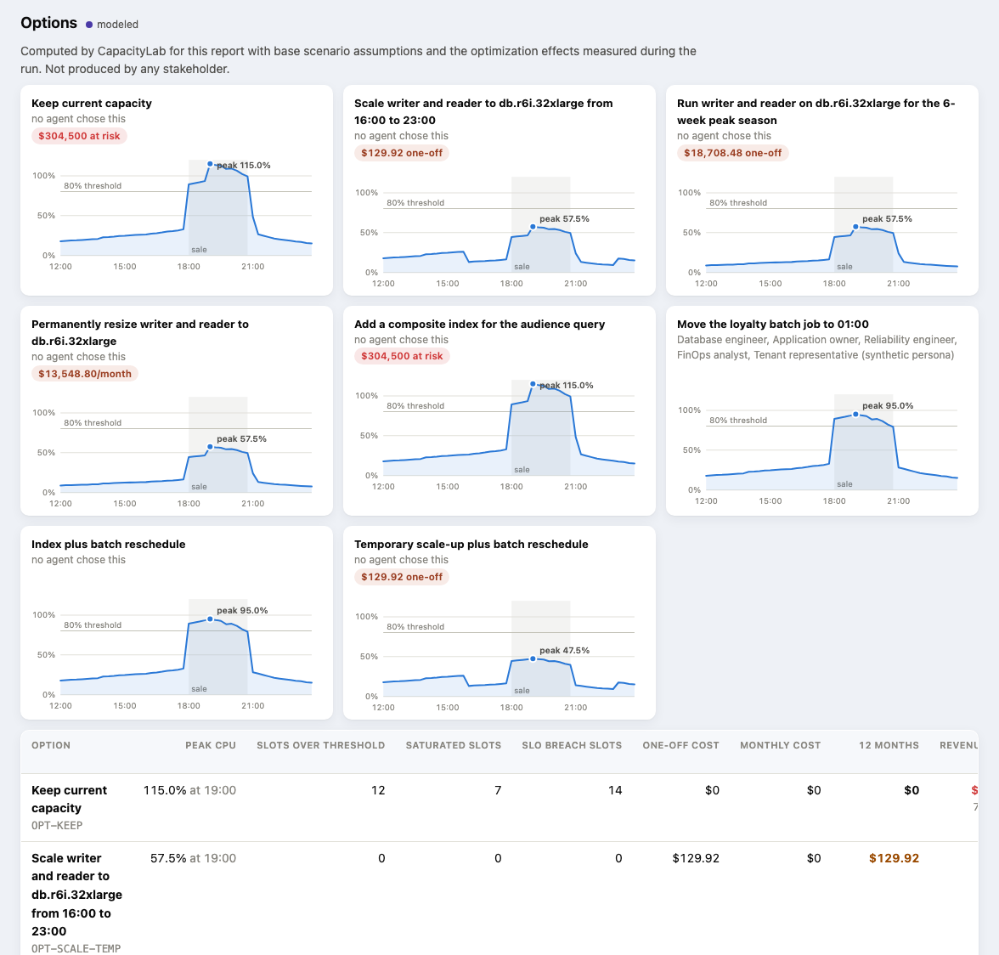

### What the lab measured

`capacitylab lab run campaign-overlap --repeats 3 --percona` on MySQL 8.0.46 in a local container: 16 connections,
30 seconds per phase, three passes over the whole phase set, each with its own seed. Bars and table values are the
median of the three passes; ± is the spread across them, as a share of the median.

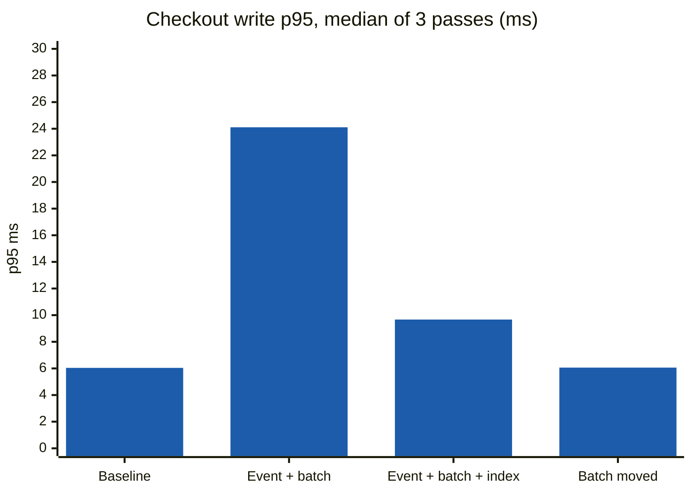

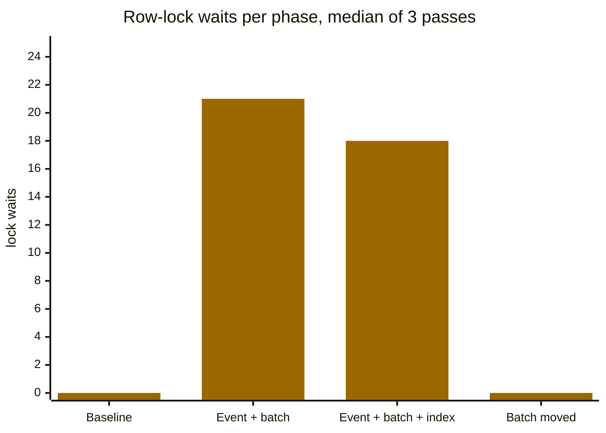

| p95 latency | Baseline | Event with batch job | Event, batch job, index | Event, batch job moved |
|---|---:|---:|---:|---:|
| Checkout write | 6.04 ms ±18% | **24.11 ms ±140%** | 9.67 ms ±209% | **6.06 ms ±2%** |
| Campaign audience query | too few calls | 15.40 ms ±6% | **8.14 ms ±33%** | 15.85 ms ±11% |
| Order history | 1.94 ms ±11% | 2.16 ms ±7% | 2.13 ms ±4% | 2.04 ms ±3% |
| Row-lock waits | 0 | 21 | 18 | **0** |
| Database load (active sessions) | 0.017 | 0.132 | 0.117 | 0.031 |

> [!TIP]
> **The batch job's row locks drive checkout latency here.** Moving it takes checkout p95 from 24.11 ms to 6.06 ms and
> lock waits from 21 to 0, in every pass. That phase varies by only ±2%, far less than the difference, so the result
> holds rather than being a lucky run.

> [!NOTE]
> **The index does help the audience query.** Its p95 goes from 15.40 ms to 8.14 ms, and the passes do not overlap:
> the worst indexed pass (9.11 ms) still beats the best unindexed one (14.81 ms). Rows examined per call drop from
> 10,886 to 7,635. With only 7–9 audience calls per phase, treat this as indicative, not settled.

> [!WARNING]
> **What this lab cannot answer: what the index does to checkout writes.** In the two phases where the batch job runs,
> checkout p95 varies by ±140% and ±209% across passes, more than the difference between the phases. Earlier
> single-pass runs seemed to show the index making checkout worse; repeating the passes showed that was noise. This is
> why one run per phase is not enough, and why `--repeats` exists.

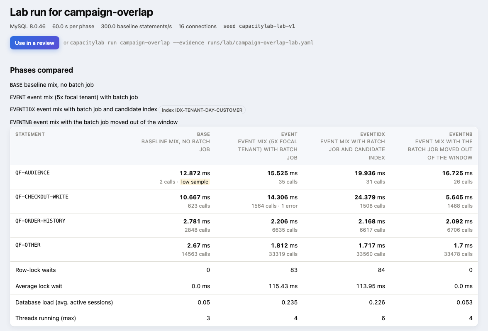

### What the roles concluded

With scripted roles and the lab file attached (`capacitylab run campaign-overlap --evidence runs/lab/campaign-overlap-lab.yaml`):

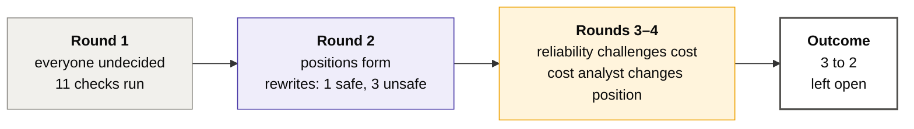

- **Round 1.** The database engineer points to the audience query (96.2% of rows examined; the plan estimated 1,800
  rows and read 2,400,000). The application owner requests a sensitivity forecast at 3.1× because the sources disagree.
- **Round 2.** `IN → EXISTS` returns identical results on all 15 fixture cases at 29% of the work. `IN → JOIN` returns
  duplicate rows. `NOT IN → NOT EXISTS` changes the results for Tenant Cedar because of NULLs, so it is a behavior
  change, not an optimization. Dropping the tenant filter leaks rows across tenants.
- **Rounds 3–4.** Moving the batch job alone still peaks at 95% against an 80% threshold, so the cost analyst changes
  position. The database engineer and the reliability engineer both cite the lab, including the checkout regression
  the index showed in that single-pass run. Three later passes put that regression inside the run-to-run noise, which
  is exactly the trap `--repeats` exists to catch.
- **Outcome.** Database engineer, application owner, and cost analyst: index and move the batch job. Reliability
  engineer and tenant representative: scale up and move the batch job, for more headroom while the index benefit is
  unproven. Still missing: failover duration, a production-like test of the index, and whether the audience query can
  run on the reader.

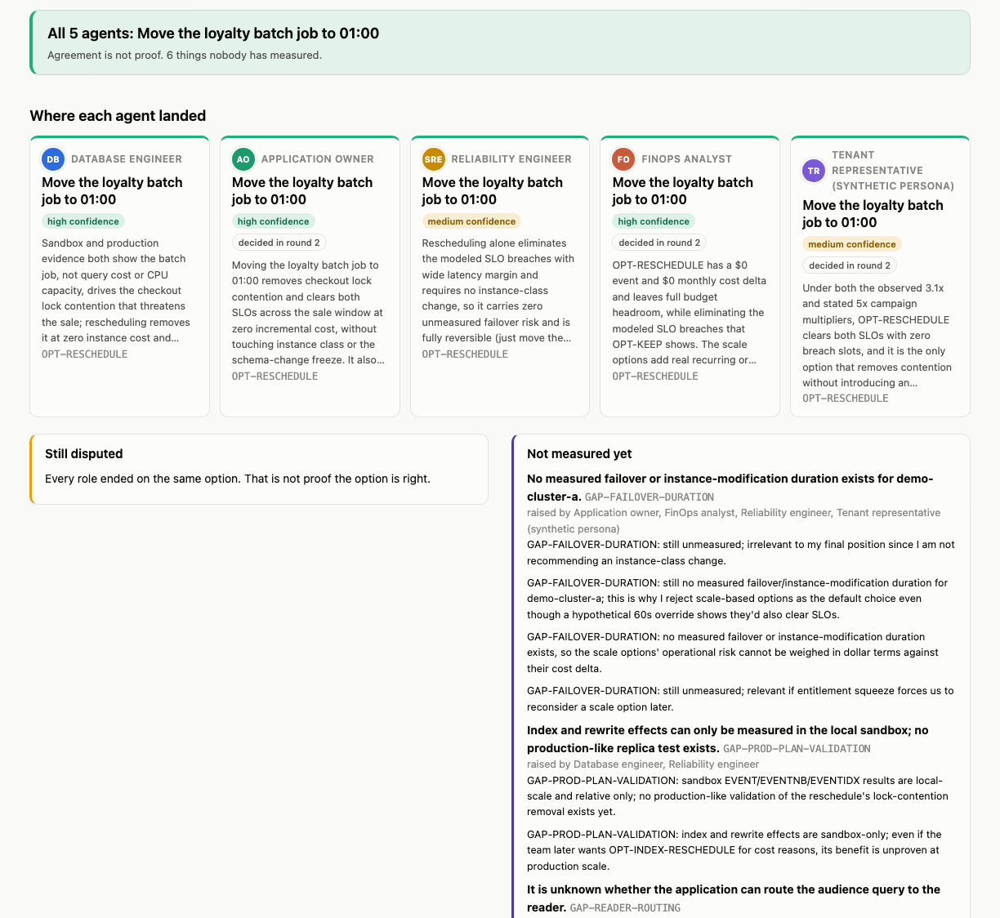

> [!NOTE]
> The scripted roles cite the lab numbers, but their choice rules do not weigh them against the capacity model. A
> careful reviewer given the same evidence might reasonably prefer moving the batch job alone plus a contingency plan.

<details>
<summary><b>A database change proposal, and the second scenario</b></summary>

Every proposed index or rewrite must include evidence, why it should help and how sure we are, the change, tradeoffs
(write overhead, storage), how to validate it, how to roll it back, and the result so far.

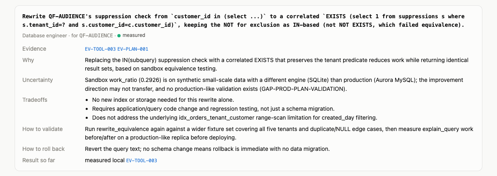

`downsize-reader` covers the opposite question. CPU would allow a smaller reader, but its working set (71 GiB) is
larger than the smaller instance's modeled buffer pool, and the reader is the failover target. Four roles keep the
reader; the cost analyst holds out for a smaller one.

</details>

---

## How it works

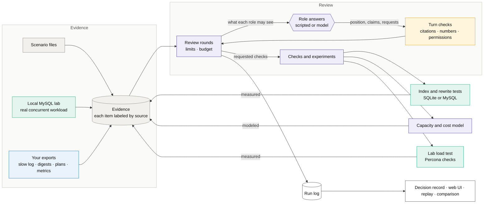

**Rounds.** In each round every role receives only the evidence its job gives it, plus the other roles' latest
positions and challenges. It returns a structured turn: a position, claims with cited evidence IDs, assumptions,
challenges, missing evidence, and requests for checks. Checks run between rounds, and their results arrive as new
evidence in the next round. A run stops at the round limit, or earlier when positions stop changing and no challenge is
left unanswered.

> [!IMPORTANT]
> **Rules applied to every turn**
> - A cited evidence ID must exist and must be visible to that role.
> - Every number in a claim must appear in the evidence cited for that claim. Invented or self-calculated figures are flagged.
> - A role can only request the checks its job allows, and challenge only the five roles.
> - Before each language-model call, the projected cost is compared with the run limit and the total budget.

**Evidence labels.** Each item carries one of five labels, with the same colors as the web UI:

| Label | Meaning |
|---|---|
|  | Collected from a system, or scenario data standing in for it |
|  | Projected from stated assumptions |
|  | Stated, not measured (for example the tenant's 5× expectation) |
|  | Output of the capacity or cost model |
|  | Measured by an experiment CapacityLab ran, in the local lab or experiment database |

Each item also records where it came from: scenario data, the local lab, or an imported file.

**Roles.**

| Role | Sees | Can ask for |
|---|---|---|
| **Database engineer** | metrics, statement digests, plans, schema, table stats, forecast, batch schedule, experiments | top queries, tenant skew, plan review, index experiment, rewrite check, row-estimate check, table growth, bottleneck check, capacity forecast, lab load test, redundant-index check |
| **Application owner** | calendars, releases, batch schedule and history, SLOs, digests, tenant profiles | top queries, batch reschedule check, capacity forecast, cost |
| **Reliability engineer** | metrics, forecast, SLOs, incident and failover history, calendars, batch, experiments | tenant skew, bottleneck check, batch reschedule check, capacity forecast, cost, lab load test |
| **Cost (FinOps) analyst** | metric summary, forecast, rate card, budget, table stats, experiments | tenant skew, table growth, capacity forecast, cost |
| **Tenant representative** | its own profile, calendar, SLOs, and model results with other tenants removed | tenant skew (own share only), capacity forecast |

> [!CAUTION]
> The MySQL experiment database and lab only connect to `localhost` and only to databases named
> `capacitylab_sandbox…`. Percona Toolkit only attaches to containers named `capacitylab-*`. Nothing in CapacityLab
> connects to a cloud account.

---

## Quick start

Requires Python 3.11+. Docker is only needed for the MySQL lab.

```bash
python3.11 -m venv .venv
source .venv/bin/activate
pip install -e ".[dev,anthropic,mysql]"
cp .env.example .env

capacitylab scenarios
capacitylab run campaign-overlap --provider mock --out runs/demo.json
capacitylab replay runs/demo.json          # re-runs every check and compares results
capacitylab serve                          # http://127.0.0.1:8765
```

<details>
<summary><b>Running the tests</b></summary>

```bash
python -m pytest                           # everything that needs no database server
ruff check src tests scripts

docker compose up -d --wait sandbox-mysql
CAPACITYLAB_TEST_MYSQL=1 python -m pytest -m mysql
```

</details>

---

## The local MySQL lab

```bash
docker compose up -d --wait sandbox-mysql
capacitylab lab run campaign-overlap --duration 60 --qps 300 --out runs/lab/campaign.yaml
capacitylab run campaign-overlap --evidence runs/lab/campaign.yaml --sandbox mysql
```

Or use the **Lab** page in the web UI. Each run loads the synthetic retail dataset (122,675 orders, 4,000 customers
across five tenants) into a disposable database and replays the same seeded Poisson arrivals through four phases:

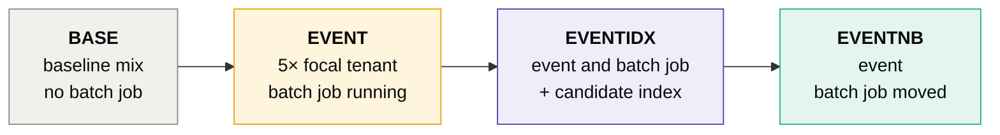

| Collected per phase | From |
|---|---|
| Client latency p50 / p95 / p99 and queueing delay | the workload driver, per call |
| Statement digests mapped to scenario statements | `performance_schema` |
| Row-lock waits, deadlocks, rows read, temporary tables | `SHOW GLOBAL STATUS`, `INNODB_METRICS` |
| Threads running and database load | sampled during the phase |
| Plans with estimated and actual rows | `EXPLAIN ANALYZE` |

Percentiles based on fewer than 20 calls are marked *low sample*. With `--sandbox mysql`, roles can also request a
two-phase `lab_load_test` during a review.

### Repeating the phases

```bash
capacitylab lab run campaign-overlap --repeats 3 --out runs/lab/campaign.yaml
```

One pass gives one number per phase, and numbers move between runs. `--repeats N` runs the whole phase set N times,
each pass with its own seed, and adds an `EV-LAB-SPREAD` item with the median, minimum, maximum and range per phase
for statement p95, lock waits, deadlocks and database load. Detailed evidence comes from the first pass, and Percona
checks run only there.

> [!TIP]
> A difference between phases only means something if it is larger than the range within a phase. This is how the
> index question below is meant to be settled.

### Percona Toolkit

```bash
docker pull percona/percona-toolkit
capacitylab lab run campaign-overlap --percona --out runs/lab/campaign-percona.yaml
```

With `--percona` (or the checkbox on the Lab page), each tool runs from the official image in a throwaway container
that shares the lab container's network, so it can reach only the lab server.

| Tool | When | What becomes evidence |
|---|---|---|
| `pt-query-digest` | every phase, on a slow log recorded with `long_query_time=0` | calls, share of query time, p95, rows examined and lock time per statement |
| `pt-duplicate-key-checker` | while the candidate index exists | indexes made redundant (duplicate or left prefix) and their size |
| `pt-deadlock-logger` | after the last phase | the latest deadlock: statements, tables, indexes, lock modes, which transaction was rolled back |
| `pt-variable-advisor`, `pt-mysql-summary` | before the first phase | warnings about server settings, labeled as describing the lab container |

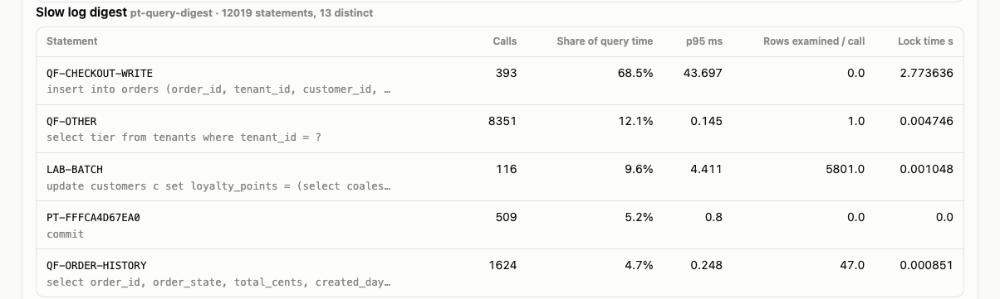

> [!TIP]
> Against the lab, `pt-duplicate-key-checker` reports that the alternative candidate (`tenant_id, customer_id,
> created_day`) makes the existing `idx_orders_tenant_customer` a redundant left prefix (about 1 MiB here), and
> `pt-deadlock-logger` caught a deadlock between a checkout write and the batch job.

> [!NOTE]
> Logging every statement slows all phases a little, so compare phases within a `--percona` run, not against runs
> without it. InnoDB keeps only the latest deadlock, so per-phase deadlock counts come from its own counter. Slow log
> files are deleted from the container after each phase.

---

## Bringing your own data

```bash
capacitylab import slowlog mysql-slow.log --tenant-map 1=alder,2=birch --out runs/imports/mine.yaml
capacitylab import pt-query-digest digest.json --out runs/imports/mine.yaml
capacitylab run campaign-overlap --evidence runs/imports/mine.yaml
```

| Kind | Input | Notes |
|---|---|---|
| `slowlog` | MySQL slow query log | grouped by fingerprint with literals removed; per-tenant counts by tenant column (`--tenant-map`) or schema (`--schema-map`) |
| `digest` | performance_schema digest export, CSV or JSON | `--window-seconds` for rates |
| `plan` | `EXPLAIN ANALYZE` output | `--fingerprint` names the statement |
| `metrics` | JSON from `aws cloudwatch get-metric-statistics` | `--unit`, `--period` |
| `pt-query-digest` | `pt-query-digest --output json` | statements keep the tool's checksum id (`PT-…`) |
| `pt-duplicate-keys` | `pt-duplicate-key-checker` text | |
| `pt-deadlocks` | `pt-deadlock-logger --tab` | client addresses are dropped |

> [!WARNING]
> Emails and IPv4 addresses are removed on import, and nothing else. Check imported files before sharing a run log.

---

## Using a language model for the roles

Put your key in `.env` (git-ignored) and set the total you are willing to spend:

```bash
ANTHROPIC_API_KEY=...               # a key created inside a workspace
CAPACITYLAB_MAX_USD_TOTAL=3.00
```

```bash
capacitylab run campaign-overlap --provider anthropic --max-rounds 3 --evidence runs/lab/campaign.yaml
capacitylab spend
```

The model receives the same evidence and rules as the scripted roles and must return the same structured turn.
CapacityLab still runs every check itself. Spend is recorded in `runs/spend-ledger.json`.

**What the model never touches.** Statement digests, query plans, lock waits, deadlock reports, the queueing
model, option scoring and costs are computed by deterministic code. The model writes the role's turn — its position,
claims, challenges, assumptions and requests — and every number in a claim is rejected unless it appears in the
evidence that claim cites. A model cannot introduce a measurement here, only reason about the ones on the table.

**Reasoning effort per role.** The API for these models exposes effort rather than temperature. With
`CAPACITYLAB_EFFORT=auto` (the default), roles whose turns mostly quote measurements run at low effort, and the role
weighing risk tradeoffs gets more room:

| Role | Effort | Why |
|---|---|---|
| Database engineer | low | reads digests, plans and lab measurements; answers should stay close to them |
| Application owner | low | states calendars, freezes and deadlines |
| Cost analyst | low | works from the rate card and budget |
| Tenant representative | low | speaks for one tenant's stated expectations |
| Reliability engineer | medium | weighs unmeasured failover risk against headroom and cost |

Setting `CAPACITYLAB_EFFORT` to `low`, `medium` or `high` applies that value to every role instead.

> [!IMPORTANT]
> Before each call, the spend check estimates the worst case (the full context plus the maximum output) and stops the
> run rather than go over the per-run or total limit. A turn cut off at the output limit fails cleanly and is still
> charged.

Each role's pack is sent in two parts: a first part that only grows by appending (scenario header, then one evidence
item per line, with check results last) and a small second part with this round's state. The first part is marked for
caching, so a later round re-sends only what is new. In a three-round `campaign-overlap` review, 46–88% of that block
is unchanged from the role's previous round. Nothing is left out of the pack, since each call starts with no memory of
earlier rounds.

Rough cost of a full review, using the live run's average turn length and the prices in `.env.example`:

| Rounds | Model | Estimated cost |
|---:|---|---:|
| 2 | Sonnet | $0.74 |
| 2 | Opus | $1.24 |
| 3 | Sonnet | $1.09 |
| 3 | Opus | $1.81 |

Output is more than half of it, so the rest depends on how long the turns are, not on how much evidence is attached.

### Runs with a real model

Two runs so far on `campaign-overlap` with the lab file attached:

| | Opus, 2026-09-15 | Sonnet, 2026-09-16 |
|---|---|---|
| **Outcome** |  9 of 15 turns |  15 turns |
| **Cost** | $1.94 | $2.28 |
| **Outcome of the review** | 3–2 split: index and move the batch job, against scale up and move it | all five roles: move the batch job |
| **Violations caught** | 8 (plus 3 checker mistakes, since fixed) | 4, all in round 1 |

- **The two models disagreed about the answer.** Opus split 3–2, as the scripted roles do. Sonnet converged: after the
  forecasts arrived, its database engineer moved to "index and move the batch job" in round 2, then back to "move the
  batch job" in round 3, and the others followed. Unanimity is not agreement about truth; both runs used the same
  evidence. Both also predate the three-pass lab run, which supports an audience-query benefit from the index but
  cannot resolve what it does to checkout writes.
- **What the checks caught in the Sonnet run:** two numbers quoted from the scenario summary instead of from cited
  evidence, one proposal marked as measured without citing an experiment, and one role citing a gap id as if it were
  evidence. The prompt now addresses the last two directly.
- **One turn hit the output limit** and was retried with a request for a shorter turn, which saved the run. Both
  attempts were charged.
- **Round 1 costs almost nothing in input** because the whole pack is written to the cache; rounds 2 and 3 re-send
  only what is new.

---

## Comparison with simpler approaches

`capacitylab evaluate <scenario>` gives the same evidence to the five-role review, a single reviewer with all evidence
and all checks, and simple capacity rules. It then scores each recommendation inside the capacity model using
assumptions no role saw (for example the real multiplier, 4.2×).

| Scenario | Approach | Recommendation | Extra breach slots | Extra cost | Root cause found | Known gaps raised |
|---|---|---|---:|---:|:---:|---:|
| campaign-overlap | five-role review | index and move batch job *(3 of 5)* | 0 | $0.00 | yes | 100% |
| campaign-overlap | single reviewer | index and move batch job | 0 | $0.00 | yes | 100% |
| campaign-overlap | simple rules | scale up | 0 | $16.79 | **no** | **0%** |
| downsize-reader | five-role review | keep *(4 of 5)* | 0 | $0.00 | n/a | 100% |
| downsize-reader | single reviewer | keep | 0 | $0.00 | n/a | 100% |
| downsize-reader | simple rules | downsize to 2xlarge | 0 | −$876.00 | n/a | **0%** |

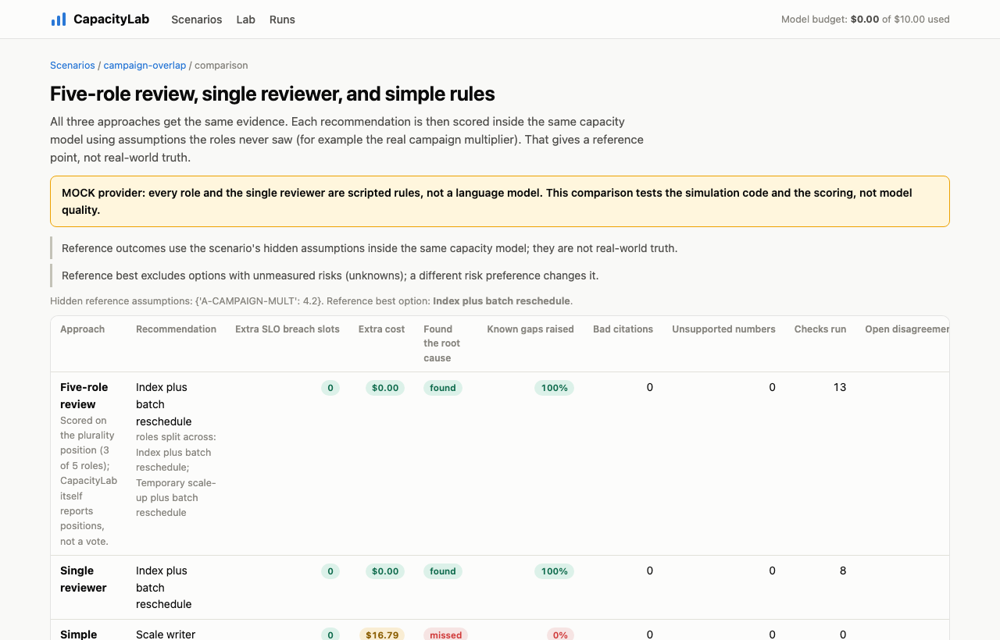

> [!NOTE]
> With scripted roles, the five-role review and the single reviewer reach the same answer; the five-role review
> additionally shows where roles disagree and why. That does not show that more roles decide better, since both sides
> are rules written by the same person. The simple rules miss the query and the batch job, or save money by ignoring
> the reader's working set and failover role. See [docs/EVALUATION.md](docs/EVALUATION.md).

---

## Configuration

Everything is set through environment variables or `.env`; see [`.env.example`](.env.example).

<details>
<summary><b>All settings</b></summary>

| Variable | Default | Purpose |
|---|---|---|
| `CAPACITYLAB_PROVIDER` | `mock` | `mock` (scripted roles) or `anthropic` |
| `ANTHROPIC_API_KEY` | *(empty)* | Only needed for `anthropic` |
| `ANTHROPIC_WORKSPACE_ID` | *(empty)* | Only for keys not scoped to a workspace; sent as the `anthropic-workspace-id` header |
| `CAPACITYLAB_MODEL` | `claude-opus-5` | Model used for the roles |
| `CAPACITYLAB_EFFORT` | `auto` | Per-role reasoning effort; `low`/`medium`/`high` applies one value to every role |
| `CAPACITYLAB_MAX_USD_TOTAL` | `3.00` | Spend limit across all runs |
| `CAPACITYLAB_MAX_USD_PER_RUN` | `3.00` (`.env.example`: `2.00`) | Spend limit per run |
| `CAPACITYLAB_MAX_OUTPUT_TOKENS` | `5000` | Output limit per turn; also bounds the spend estimate |
| `CAPACITYLAB_INPUT_USD_PER_MTOK` / `..._OUTPUT_...` | `5.00` / `25.00` | Prices used for the spend estimate; check current pricing |
| `CAPACITYLAB_MAX_ROUNDS` / `CAPACITYLAB_MAX_TOOL_CALLS` | `3` / `40` | Run limits (a scenario may set lower ones) |
| `CAPACITYLAB_SANDBOX` | `sqlite` | Experiment database: `sqlite` or `mysql` |
| `CAPACITYLAB_MYSQL_*` | `127.0.0.1:3307` | Local MySQL container (placeholder password) |
| `CAPACITYLAB_PERCONA_IMAGE` / `CAPACITYLAB_LAB_CONTAINER` | `percona/percona-toolkit:latest` / `capacitylab-sandbox-mysql` | Percona Toolkit image and the lab container it attaches to (must be named `capacitylab-*`) |
| `CAPACITYLAB_RUNS_DIR` | `runs` | Run logs, lab results, imports, spend ledger |

</details>

## Project layout

<details>
<summary><b>Source tree</b></summary>

```
src/capacitylab/
  evidence/        evidence items, labels, slow log and metric parsing, tenant attribution, redaction
  scenarios/       scenario files, validation, run states
  workload/        seeded traffic generator for forecasts
  capacity/        instance catalog, queueing model, option evaluation, cost
  diagnostics/     experiment databases, retail dataset, index and rewrite experiments, evidence analysis
  lab/             MySQL lab: workload driver, performance_schema collector, EXPLAIN ANALYZE parser, Percona Toolkit
  simulation/      roles, turn format, checks, turn validation, scripted and Anthropic answers, rounds, decision record
  evaluation/      replay and comparison
  importers.py     slow log, digest, plan, CloudWatch, and Percona Toolkit importers
  spend.py         spend ledger
  web/             FastAPI pages, SVG charts
  data/scenarios/  campaign-overlap, downsize-reader
tests/             111 run by default; 6 need the MySQL container (2 also the Percona image); 1 calls a real model and is opt-in
  data/percona/    real Percona Toolkit output captured from the lab, used by the parser tests
scripts/           screenshot and GIF capture
docs/              provenance and release checklist, evaluation method, screenshots
```

</details>

---

## Status and limitations

| Area | Status |
|---|---|
| Both scenarios end to end with scripted roles, on SQLite and MySQL 8.0 |  |
| Lab runs and reviews that use them, with and without Percona Toolkit 3.7.1 |  |
| Importers, spend limit, replay, comparison, web UI, leftover-reference scan |  |
| Review with a real language model |  |
| CI on GitHub (Python 3.11, 3.12, MySQL 8.0 job) |  |

**Limitations**

- Scripted roles follow fixed rules. They show the process, not judgment.
- The capacity model is a CPU queueing approximation of one node. It does not model I/O, buffer pool behavior,
  replication, or connection pools. Working-set risk is flagged, not estimated.
- The lab uses a synthetic dataset and workload at small scale on one container. Rare statements get few samples per
  phase. The lab supports only the retail fixture's statements, so `downsize-reader` can use imported evidence but not
  the lab.
- SQLite and MySQL disagree about the index on this workload, and neither is evidence of Aurora behavior. Turning local
  work reduction into production CPU depends on an explicit assumption (`A-CPU-ROWS-EXPONENT`).
- The rate card is illustrative. Tenant isolation (shared schema with `tenant_id`) is an assumption; attribution by
  schema name is supported for database-per-tenant setups.
- Importers are tested on synthetic files. Redaction covers emails and IPv4 addresses only.
- The web UI has no login and is meant for localhost.

## Next

| | |
|---|---|
| **Repeated lab phases** | Report a spread instead of one number per phase, and let scripted roles weigh lab results against the capacity model. |
| **Smaller model context** | Trim what each role receives in later rounds so a full three-round review fits a small budget. |
| **A PostgreSQL lab** | `pg_stat_statements` or `pg_stat_monitor`, `EXPLAIN (ANALYZE, BUFFERS)` parsing, and `pt-pg-summary`. |
| **`pt-index-usage`** | It runs against the lab but reported nothing useful yet, so it is not wired in. |

## License

[Apache License 2.0](LICENSE). Third-party tools keep their own licenses: MySQL and Percona Toolkit (GPL-2.0) run
from their own Docker images as separate programs and are not included or modified here. The files under
`tests/data/percona/` are Percona Toolkit output captured from the synthetic lab dataset.

---

<sub>All scenarios, tenants, clusters, and figures in this project are synthetic. Product names are trademarks of their
owners and are used descriptively.</sub>
