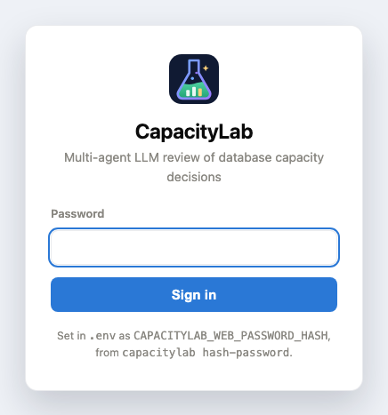

# Configuration

Everything is set through environment variables or `.env`; see [`.env.example`](../.env.example).

<details>
<summary><b>All settings</b></summary>

| Variable | Default | Purpose |
|---|---|---|
| `CAPACITYLAB_PROVIDER` | `mock` | `mock` (scripted agents), `anthropic`, or `openai` (any OpenAI-compatible endpoint) |
| `CAPACITYLAB_LLM_PROVIDER` | the provider above, else `anthropic` | Which LLM provider the web UI offers next to the scripted agents |
| `CAPACITYLAB_LLM_BASE_URL` / `CAPACITYLAB_LLM_API_KEY_ENV` | *(empty)* / `OPENAI_API_KEY` | `openai` provider: endpoint, and the variable that holds its key (local servers need none) |
| `CAPACITYLAB_CACHED_INPUT_MULTIPLIER` / `CAPACITYLAB_REASONING_EFFORT` | `1.0` / *(unset)* | `openai` provider: price of cached input relative to input; `reasoning_effort` sent only when set |
| `ANTHROPIC_API_KEY` | *(empty)* | Only needed for `anthropic` |
| `ANTHROPIC_WORKSPACE_ID` | *(empty)* | Only for keys not scoped to a workspace; sent as the `anthropic-workspace-id` header |
| `CAPACITYLAB_MODEL` | `claude-opus-5` | Model used by the agents, for whichever provider is selected |
| `CAPACITYLAB_EFFORT` | `auto` | Per-role reasoning effort; `low`/`medium`/`high` applies one value to every role |
| `CAPACITYLAB_MAX_USD_TOTAL` | `3.00` | Spend limit across all runs |
| `CAPACITYLAB_MAX_USD_PER_RUN` | `3.00` (`.env.example`: `2.00`) | Spend limit per run |
| `CAPACITYLAB_MAX_OUTPUT_TOKENS` | `5000` | Output limit per turn; also bounds the spend estimate |
| `CAPACITYLAB_INPUT_USD_PER_MTOK` / `..._OUTPUT_...` | `5.00` / `25.00` | Prices used for the spend estimate; check current pricing |
| `CAPACITYLAB_MAX_ROUNDS` / `CAPACITYLAB_MAX_TOOL_CALLS` | `3` / `40` | Run limits (a scenario may set lower ones) |
| `CAPACITYLAB_SANDBOX` | `sqlite` | Experiment database: `sqlite` or `mysql` |
| `CAPACITYLAB_MYSQL_*` | `127.0.0.1:3307` | Local MySQL container (placeholder password) |
| `CAPACITYLAB_POSTGRES_*` | `127.0.0.1:5433` | Local PostgreSQL container (placeholder password) |
| `CAPACITYLAB_PERCONA_IMAGE` / `CAPACITYLAB_LAB_CONTAINER` | `percona/percona-toolkit:latest` / `capacitylab-sandbox-mysql` | Percona Toolkit image and the lab container it attaches to (must be named `capacitylab-*`) |
| `CAPACITYLAB_AWS_ENDPOINT` / `CAPACITYLAB_AWS_REGION` | `http://127.0.0.1:4566` / `us-east-1` | AWS emulator and region used by the web UI's AWS page |
| `CAPACITYLAB_AWS_LIVE` | `false` | `true` lets the web UI read a real AWS account with your normal credentials (read calls only) |
| `CAPACITYLAB_GCP_PROJECT` / `CAPACITYLAB_GCP_ENDPOINT` / `CAPACITYLAB_GCP_LIVE` | `capacitylab-demo` / `http://127.0.0.1:4588` / `false` | Google Cloud project, emulator and live switch for the web UI's Google Cloud page |
| `CAPACITYLAB_AZURE_SUBSCRIPTION` / `..._RESOURCE_GROUP` / `..._ENGINE` | `demo-subscription` / `capacitylab-demo` / `mysql` | Azure scope and flexible server engine for the web UI's Azure page |
| `CAPACITYLAB_AZURE_ENDPOINT` / `CAPACITYLAB_AZURE_LIVE` | `http://127.0.0.1:4577` / `false` | Azure emulator and live switch |
| `CAPACITYLAB_WEB_PASSWORD_HASH` / `CAPACITYLAB_WEB_PASSWORD` | *(empty)* | Sign-in for the web UI. Generate the hash with `capacitylab hash-password`; the plain form exists for convenience only |
| `CAPACITYLAB_SESSION_SECRET` / `CAPACITYLAB_SESSION_HOURS` | *(empty)* / `12` | Keeps sessions valid across restarts, and how long one lasts |
| `CAPACITYLAB_SOURCE_URL` | this repository | Where the footer points for source, as the AGPL asks when you host it for other people |
| `CAPACITYLAB_RUNS_DIR` | `runs` | Run logs, lab results, imports, the history store, the spend ledger |

</details>

## Signing in

The UI is open when no password is set, which is what you want on `127.0.0.1`. Set one and every page needs a session:

```bash
capacitylab hash-password          # prints the two lines to paste into .env
capacitylab serve --port 8765
```

<p align="center">
  
</p>

It stores a PBKDF2-SHA256 hash, never the password, compares in constant time, and issues a signed cookie carrying
only an expiry. Wrong guesses are rate limited, and `serve` refuses any address other than localhost while no password
is set, rather than exposing every run to whoever can reach the port. `CAPACITYLAB_SESSION_SECRET` keeps sessions
valid across restarts; without it everyone is signed out when the process stops.
