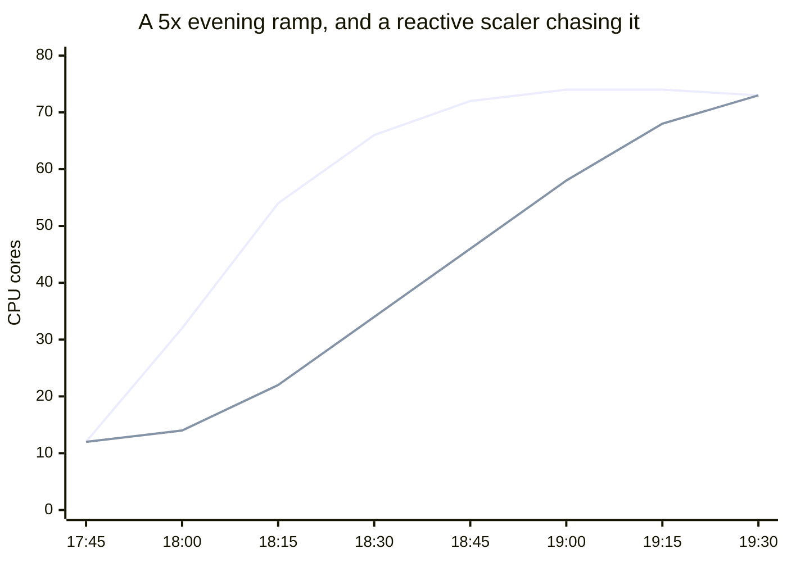
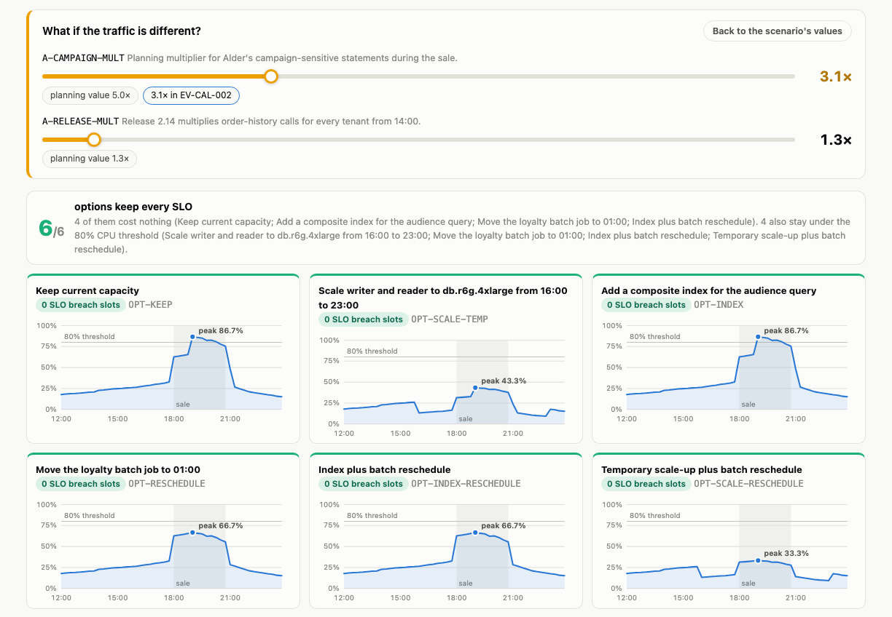
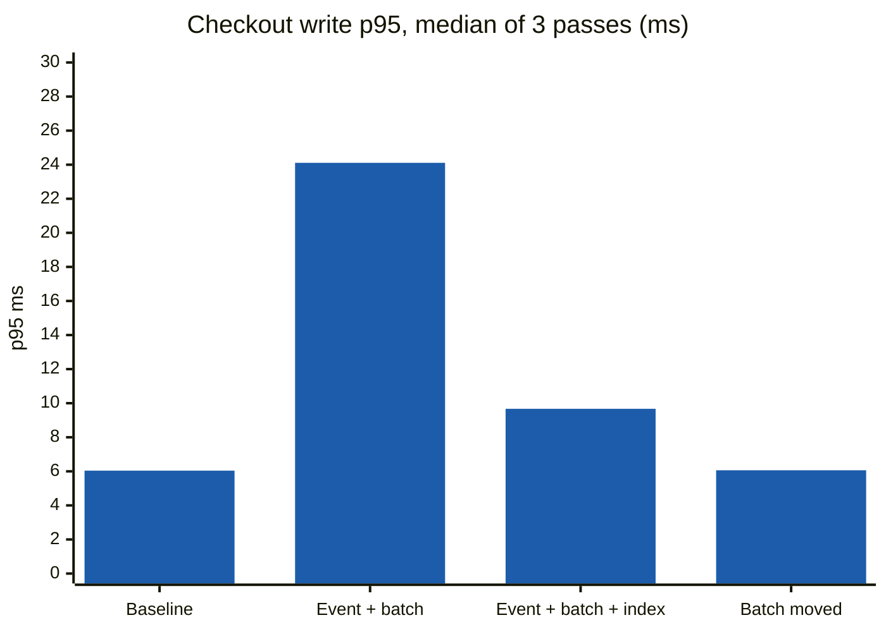
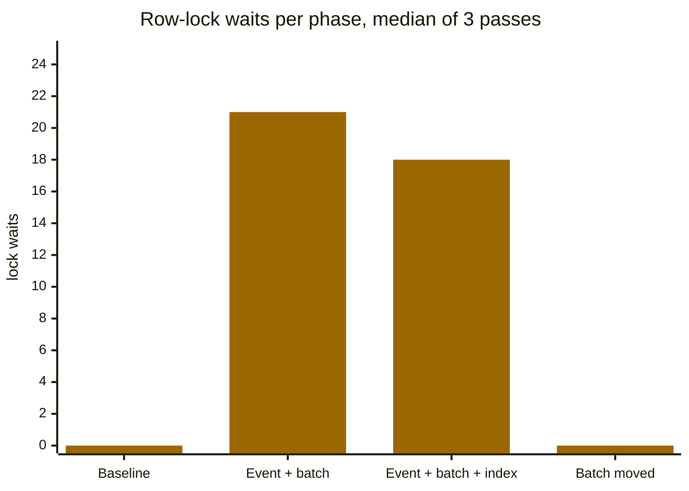
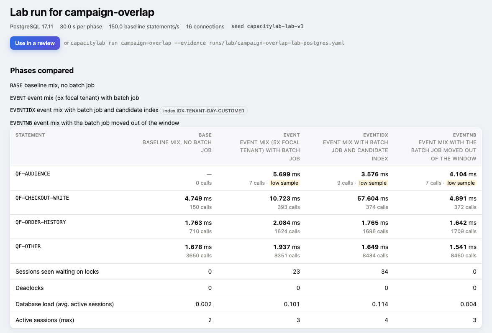
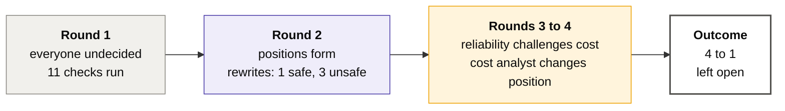
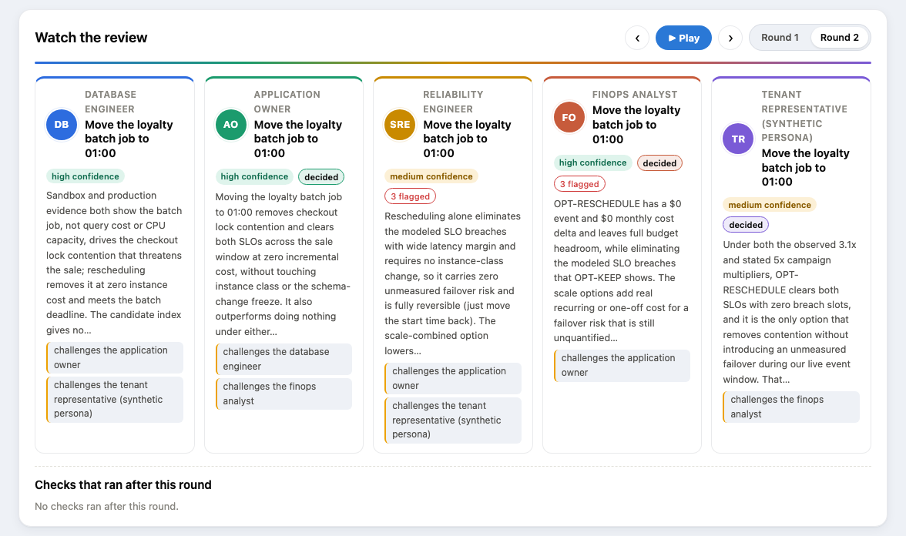

# Example: a flash sale meets a batch job

The `campaign-overlap` scenario in detail: the question, the money, the tenants, what drives the load, what the
capacity model and the lab say, and where the scripted agents landed.

## Why not just let it autoscale?

**Because autoscaling reacts, and an event you already know about deserves a decision made before it starts.**



The upper line is what the workload asks for. The lower one is capacity arriving behind it. **Everything between them
is checkout queueing, timing out and retrying**, and those retries look like yet more load, so the scaler chases a
target its own victims keep raising. By the time the two lines meet, the sale is half over and the carts are gone.
Scaling back down afterwards is deliberately slower, so you pay for the overshoot as well. (Shape illustrative; the
lag depends on the workload.)

| 👀 What a reactive scaler sees | 🧭 What the decision actually needs |
|---|---|
| CPU, connections and I/O, **as they are now** | 📅 a campaign that starts at 18:00, announced weeks ago |
| Load **after** it has arrived | 💰 $1.45M an hour at stake while it runs |
| Retries, indistinguishable from demand | 🧑‍🤝‍🧑 one tenant about to take a third of the cluster |
| Nothing about **why** | 🗓️ a batch job landing at 19:00, and a release that raised traffic 1.3x |

CapacityLab puts those product signals beside the database metrics, prices every option, and shows the revenue at risk
if nothing changes, so the call is made with a lead time long enough to survive a failover, and the reasoning is on
the record afterwards.

> [!NOTE]
> This is an argument the agents have to **win, not assume**. The scenario carries "how long would autoscaling take to
> catch up" as an unmeasured assumption (`A-AUTOSCALE-LAG`) and an evidence gap (`GAP-AUTOSCALE-RESPONSE`), so anyone
> claiming "it would have scaled in time" has to say where that number came from.

## The scenario

The `campaign-overlap` scenario: Tenant Alder runs a sale from 18:00 to 21:00 on `demo-cluster-a`, a shared
production cluster with a writer and a reader on `db.r6i.16xlarge` (64 vCPU each; $9.28 an hour × 730 hours × 2 nodes =
$13,548.80 a month in instances, against a $16,500 budget). Other tenants peak at the same time, a release raises
order-history traffic, and the loyalty recalculation job starts at 19:00. Alder's previous sale earned $2.9 million in two hours.

| On the table | How it is calculated |
|---|---|
|  | previous sale $2,900,000 ÷ 2 h = $1,450,000 an hour; × 3 h of sale = $4,350,000 |
|  | 7 breached 15-minute sale slots × 0.25 h × $1,450,000 an hour × 12% lost = $304,500 |
|  | 32xlarge $18.56 − 16xlarge $9.28 = $9.28 more an hour × 7 h (16:00 to 23:00) × 2 nodes = $129.92 |
|  | $9.28 more an hour × 24 h × 42 days × 2 nodes = $18,708.48 |
|  | $9.28 more an hour × 730 h × 2 nodes = $13,548.80 a month; × 12 = $162,585.60 a year |
|  | no instance change; keeps every SLO in the model, but runs at 95% CPU at the peak |

Every instance price is $0.145 per vCPU-hour ($9.28 = 64 vCPU × $0.145), and a month is 730 hours. The sale's revenue
per hour is held at the previous sale's rate rather than raised with the 5× traffic plan, so the revenue at risk is a
conservative figure.

```mermaid
gantt
  title The evening on demo-cluster-a
  dateFormat HH:mm
  todayMarker off
  axisFormat %H:%M
  section Traffic
    Release 2.14 raises order history   :active, rel, 14:00, 10h
    Other tenants' evening peak         :peak, 18:00, 3h
  section Alder
    Flash sale, 5x planned (3.1x last time) :crit, sale, 18:00, 3h
  section Batch
    Loyalty recalculation, 90 min       :crit, batch, 19:00, 90m
  section Scale-up option
    32xlarge window, 2 failovers         :done, scale, 16:00, 7h
```



> [!IMPORTANT]
> The tenant expects 5× traffic, but its last sale peaked at 3.1×. CapacityLab flags the conflict instead of picking
> one, and makes the planning value (5×) an explicit assumption every role can see and challenge.

### The assumptions it rests on

Every number the model leans on without a measurement is written down, with what it is based on. Roles can ask for a
forecast with any of them changed.

| Assumption | Value | Why it is an assumption | Based on |
|---|---:|---|---|
| `A-CAMPAIGN-MULT` | 5.0× | The tenant's stated expectation for the sale; its last comparable sale peaked at 3.1× | tenant profile, event calendar |
| `A-RELEASE-MULT` | 1.3× | Estimated effect of release 2.14 on order-history calls | release calendar |
| `A-CPU-ROWS-EXPONENT` | 0.8 | Turns work saved in a local experiment into production CPU; never measured | nothing measured |
| `A-PROD-ORDERS-ROWS` | 57,600,000 rows | Production size of `orders`, used to extrapolate index size | table statistics |
| `A-SALE-REVENUE-PER-HOUR` | $1,450,000 | Revenue per hour of the sale; based on the previous sale, not scaled with traffic | event calendar |
| `A-CHECKOUT-LOSS-SHARE` | 12% | Share of a slot's sale revenue lost while checkout or order history misses its SLO; never measured for this tenant | tenant profile |
| `A-FAILOVER-SECONDS` | unknown | Writer failover time during an instance change; never measured on this cluster | nothing measured |
| `A-BUFFER-POOL-FRACTION` | 0.75 | Buffer pool share of instance memory in `downsize-reader`; common default, parameter group not checked | nothing measured |

### Who gets the capacity

On a shared cluster, a sale is not only a capacity question; it is a question of who is entitled to the capacity there
is. Each tenant's plan is evidence (tier, contract value, the CPU share it guarantees; synthetic here), and CapacityLab
compares it with the CPU share each tenant's workload takes, modeled from calls per second and CPU per call:

| Tenant | Plan | Contract | Guaranteed | Normal evening | During Alder's sale (5×) |
|---|---|---:|---:|---:|---:|
| Alder | premium | $185,000/month | 35% | 42.5% |  |
| Birch | standard | $72,000/month | 20% | 23.0% |  |
| Cedar | standard | $61,000/month | 20% | 16.4% |  |
| Dune | standard | $44,000/month | 15% | 11.1% |  |
| Elm | basic | $16,000/month | 10% | 7.0% |  |

*Over* means more than 125% of the guaranteed share; *squeezed* means less than 60% of it.

> [!IMPORTANT]
> The burst has to come from somewhere. Either Alder's plan covers capacity for announced events, capacity is bought
> for the window, or the guaranteed shares of the other four tenants absorb it. CapacityLab reports the levers that
> exist and their limits rather than pretending a governor is in place: per-tenant limits in the application's
> connection pool (with a shared schema the database usually cannot tell tenants apart), MySQL 8.0 resource groups
> for thread priority where the engine supports them (managed MySQL variants may not), or capacity for the window.

The review is available to the application owner, reliability engineer and cost analyst as
`tenant_entitlement_review`; the tenant representative sees only its own plan.

### Who is actually causing it

"The writer saturates at 19:00" is a symptom, and the remedies differ by an order of magnitude in cost, so the first
question is what is behind it. Every breaching slot is decomposed into the same CPU demand the capacity model used:

```
What is driving the busiest slots: loyalty-recalculation 18.5%, alder 68.5%
  Across 12 slots (18:00 to 20:45), the worst is 19:00 at 115% of the node.
  By statement: QF-OTHER 28.3%, QF-ORDER-HISTORY 24%, QF-AUDIENCE 20.7%.
  By tenant:    alder 64.8%, birch 7.1%.
  what to do: move the batch job (loyalty-recalculation, 18.5%);
              check this tenant's share against what they pay for (alder, 68.5%)
```

The shares are of modeled demand, not a second estimate: they add up to the same utilization the option table shows.
Four shapes get four different answers:

| What the slot looks like | What it argues for |
|---|---|
| A batch job holds a large share while it runs | Move it. Work with a deadline but no audience is the cheapest thing to move, if the deadline still holds |
| One statement dominates | An index experiment or a rewrite equivalence check. Either is cheaper than capacity |
| One tenant dominates | An entitlement question, not a capacity one: compare their share with what they pay for |
| Nothing dominates | Capacity is the honest remedy, because there is nothing cheaper to fix first |

Each cause also says **how sure the reading is**, because "one tenant is 68% of the demand in all twelve slots, 61
points ahead of the next" and "one statement scrapes past 40% in half of them" deserve different treatment. Confidence
comes from three things anyone can check: the margin over the threshold that named it, the lead over the next subject,
and how many of the breaching slots it actually leads. A tie between two subjects reads as low confidence rather than
picking one.

It attributes under any option, not just today's, so "what would still be driving this after we move the batch job"
is answerable before deciding. Agents can call it as the `load_attribution` tool, and it reports the thresholds it
applied rather than hiding them.

Two limits stated in the output itself: the shares are only as good as the forecast rates and the cost per execution
they rest on, and **attribution stops at the statement and the tenant**. Which service or code path issues a statement
is not in this evidence, so it cannot tell you which team owns the fix.

### What the capacity model says

From the scripted run, with the index and rewrite effects measured in the SQLite experiment database:

| Option | Peak CPU | Slots over 80% | SLO breach slots | One-off | Monthly | Revenue at risk |
|---|---:|---:|---:|---:|---:|---:|
| Keep capacity | 115.0% | 12 |  | $0 | $0 | **$304,500** |
| Scale to 32xlarge, 16:00 to 23:00 | 57.5% | 0 |  | $129.92 | $0 | $0 |
| Scale to 32xlarge for the 6-week season | 57.5% | 0 |  | $18,708.48 | $0 | $0 |
| Resize to 32xlarge permanently | 57.5% | 0 |  | $0 | $13,548.80 | $0 |
| Add the index | 97.7% | 8 |  | $0 | $0.08 | $0 |
| Rewrite the audience query (`EXISTS`) | 100.1% | 8 |  | $0 | $0 | $0 |
| Move the batch job to 01:00 | 95.0% | 11 |  | $0 | $0 | $0 |
| Index and move the batch job | 77.7% | 0 |  | $0 | $0.08 | $0 |
| Scale up and move the batch job | 47.5% | 0 |  | $129.92 | $0 | $0 |
| Rewrite and move the batch job | 80.1% | 1 |  | $0 | $0 | $0 |

Every scale option also carries writer failovers of unknown length. The scripted FinOps agent reads this table on a
12-month view, which is why a $129.92 evening beats a $13,548.80-a-month resize even though both keep every SLO.

**A query rewrite competes here on the same terms.** It buys no instance hours and needs no storage, so it costs $0 to
run; what it costs is a release and a validation. The row above is the honest outcome: the measured `EXISTS` rewrite
takes the peak from 115.0% to 100.1%, which still misses the SLO in 2 slots, so on its own it is not the answer.
Paired with moving the batch job it holds every SLO at $0, which is cheaper than the index pairing ($0.08 a month) and
far cheaper than the evening scale-up. Two guards keep that from being wishful: no benefit is credited until an
equivalence check has measured it, and a rewrite that returns different rows than the original gets no benefit at all,
however much work it saves: changing the answer is not an optimization.

That guard earns its keep: of the four candidate rewrites, only one is equivalent on the fixtures, and the three that
fail do so for three different reasons.

| Candidate | Work | Equivalent | What the check caught |
|---|---:|---|---|
| `EXISTS`, tenant predicate kept | 0.29x | ✅ | - |
| inner `JOIN` on orders | 0.67x | ❌ | join fan-out returns duplicate rows |
| `NOT IN` to `NOT EXISTS` | 2.71x | ❌ | a NULL `customer_id` in suppressions makes `NOT IN` return nothing and `NOT EXISTS` return rows |
| `EXISTS` without the tenant predicate | 0.34x | ❌ | extra rows qualify only through another tenant's orders: a tenant boundary violation |

The last one is the dangerous kind. It looks like the winner, being three times cheaper, and it leaks one tenant's
customers into another tenant's audience. A benchmark that only timed the two statements would have recommended it.

*SLO breach slots* counts each SLO separately: when nothing changes, checkout and order history each miss their SLO in
the same 7 sale slots, so 7 × 2 = 14. *Revenue at risk* counts the slot once. The index costs $0.08 a month: the
candidate measured 1,835,008 bytes on 122,675 local rows, which scales to 0.802 GiB at 57,600,000 production rows, and
0.802 GiB × $0.10 = $0.08.

Prices come from the scenario's own rate-card evidence (`EV-RATE-001`), not from code: the cost model reads it from
the evidence bundle, and a scenario without one fails validation. An AWS import with prices replaces the instance
rates for that review (see [Straight from your cloud](IMPORTS.md#straight-from-your-cloud)). The numbers shipped here are
illustrative and
labelled as an assumption: on-demand rates at production scale ($0.145 per vCPU-hour) without reserved-instance or
savings-plan discounts. Replacing that one evidence item with your provider's rates re-prices every option.


On the scenario page, drag the traffic assumption and every option is re-modeled on the spot. At the 3.1× the tenant
actually reached last time, all ten options keep every SLO and doing nothing risks $0; at the 5× planning value, seven
keep every SLO and doing nothing risks $304,500; at 6×, only the four scale-up options do, and doing nothing risks
$522,000:



The chart above comes from the two-round LLM review, not the scripted run. Its index options show no benefit because
no agent in that run asked for an index experiment, and the model credits an index with nothing until one is measured.
The table above comes from the scripted run, which measured the proposed index.

### What the lab measured

`capacitylab lab run campaign-overlap --repeats 3 --percona` on MySQL 8.0.46 in a local container: 16 connections,
30 seconds per phase, three passes over the whole phase set, each with its own seed. Bars and table values are the
median of the three passes; ± is the spread across them, as a share of the median.





| p95 latency | Baseline | Event with batch job | Event, batch job, index | Event, batch job moved |
|---|---:|---:|---:|---:|
| Checkout write | 6.04 ms ±18% | **24.11 ms ±140%** | 9.67 ms ±209% | **6.06 ms ±2%** |
| Campaign audience query | too few calls | 15.40 ms ±6% | **8.14 ms ±33%** | 15.85 ms ±11% |
| Order history | 1.94 ms ±11% | 2.16 ms ±7% | 2.13 ms ±4% | 2.04 ms ±3% |
| Row-lock waits | 0 | 21 | 18 | **0** |
| Database load (active sessions) | 0.017 | 0.132 | 0.117 | 0.031 |

> [!TIP]
> **The batch job's row locks drive checkout latency here.** Moving it takes checkout p95 from 24.11 ms to 6.06 ms and
> lock waits from 21 to 0, in every pass. That phase varies by only ±2%, far less than the difference, so the result
> holds rather than being a lucky run.

> [!NOTE]
> **The index does help the audience query.** Its p95 goes from 15.40 ms to 8.14 ms, and the passes do not overlap:
> the worst indexed pass (9.11 ms) still beats the best unindexed one (14.81 ms). Rows examined per call drop from
> 10,886 to 7,635. With only 7 to 9 audience calls per phase, treat this as indicative, not settled.

> [!WARNING]
> **What this lab cannot answer: what the index does to checkout writes.** In the two phases where the batch job runs,
> checkout p95 varies by ±140% and ±209% across passes, more than the difference between the phases. Earlier
> single-pass runs seemed to show the index making checkout worse; repeating the passes showed that was noise. This is
> why one run per phase is not enough, and why `--repeats` exists.

#### The same phases on PostgreSQL 17

`capacitylab lab run campaign-overlap --engine postgres --repeats 3` on PostgreSQL 17.11: the same dataset, seeds,
connections and phase length.

| p95 latency | Baseline | Event with batch job | Event, batch job, index | Event, batch job moved |
|---|---:|---:|---:|---:|
| Checkout write | 5.37 ms ±23% | 12.59 ms ±132% | 36.97 ms ±134% | **5.25 ms ±9%** |
| Campaign audience query | too few calls | 5.70 ms ±26% | **2.90 ms ±39%** | 3.69 ms ±24% |
| Order history | 1.77 ms ±9% | 1.63 ms ±32% | 1.73 ms ±9% | 1.64 ms ±12% |
| Lock waits (session-seconds) | 0 | 2.3 | 2.6 | **0** |
| Database load (active sessions) | 0.002 | 0.101 | 0.098 | 0.004 |

<table>
<tr>
<td width="50%" valign="top">

**Where the engines agree.** Moving the batch job clears lock waits in every pass on both engines, and checkout
p95 returns to baseline (5.25 ms, ±9%). Database load drops from about 0.1 active sessions to 0.004.

</td>
<td width="50%" valign="top">

**Where they differ.** PostgreSQL recorded no deadlocks; MySQL did. With the batch job running, PostgreSQL checkout p95
varies even more (±132%, ±134%), so the index's effect on writes stays unanswered here too.

</td>
</tr>
</table>

> [!NOTE]
> On PostgreSQL the index also speeds up the audience query while the batch job runs: the slowest indexed pass
> (3.58 ms) beats the fastest unindexed one (5.31 ms). But with the batch job moved and no index, the query already
> runs at 3.22 to 4.10 ms. With 7 to 9 calls per phase, the lab cannot yet separate the index's benefit from the batch job's
> cost.



> [!IMPORTANT]
> PostgreSQL keeps no cumulative lock-wait counter. Lock waits here come from sampling `pg_stat_activity` every
> 0.1 s, so they are session-seconds rather than a count of waits, and they are not comparable with the MySQL row.


### What the agents concluded

With scripted roles and the lab file attached (`capacitylab run campaign-overlap --evidence runs/lab/campaign-overlap-lab.yaml`).
The LLM runs are [in LLM.md](LLM.md#runs-with-a-real-model).



-  The database engineer points to the audience query (96.2% of rows examined; the plan estimated 1,800
  rows and read 2,400,000). The application owner requests a sensitivity forecast at 3.1× because the sources disagree.
-  `IN → EXISTS` returns identical results on all 15 fixture cases at 29% of the work. `IN → JOIN` returns
  duplicate rows. `NOT IN → NOT EXISTS` changes the results for Tenant Cedar because of NULLs, so it is a behavior
  change, not an optimization. Dropping the tenant filter leaks rows across tenants.
-  Moving the batch job alone still peaks at 95% against an 80% threshold, so the cost analyst changes
  position. The database engineer and the reliability engineer both cite the lab, including the checkout regression
  the index showed in that single-pass run. Three later passes put that regression inside the run-to-run noise, which
  is exactly the trap `--repeats` exists to catch.
-  Database engineer, application owner, cost analyst and tenant representative: index and move the batch
  job, at $0.08 a month. Reliability engineer: scale up and move the batch job ($130 plus failovers), for more headroom
  while the index benefit is unproven. The cost analyst also puts doing nothing at $304,500 of sale revenue at risk.
  Still missing: failover duration, a production-like test of the index, and whether the audience query can
  run on the reader.


Step through the rounds, or press play, to watch each agent's position change and see the checks that ran between
rounds:



*Screenshots of runs are from the two-round LLM review described [in LLM.md](LLM.md#runs-with-a-real-model),
where every role converged; the rounds above describe the scripted run, which split 4 to 1.*

> [!NOTE]
> The scripted roles cite the lab numbers, but their choice rules do not weigh them against the capacity model. A
> careful reviewer given the same evidence might reasonably prefer moving the batch job alone plus a contingency plan.

<details>
<summary><b>A database change proposal, and the second scenario</b></summary>

Every proposed index or rewrite must include evidence, why it should help and how sure we are, the change, tradeoffs
(write overhead, storage), how to validate it, how to roll it back, and the result so far.


`downsize-reader` covers the opposite question. The cluster runs a writer and a reader on `db.r6i.32xlarge` (128 vCPU,
$18.56 × 730 h × 2 nodes = $27,097.60 a month against a $25,000 budget), and the reader peaks at 18.7% CPU. Downsizing
it to `16xlarge` saves ($18.56 − $9.28) × 730 h = $6,774.40 a month ($81,292.80 a year); to `8xlarge`, ($18.56 − $4.64)
× 730 h = $10,161.60 a month ($121,939.20 a year). CPU would allow either, but the
working set (568 GiB) is larger than the smaller instance's modeled buffer pool, and the reader is the failover
target. Four agents keep the reader; the cost analyst holds out for the $81,292.80 a year.

</details>
