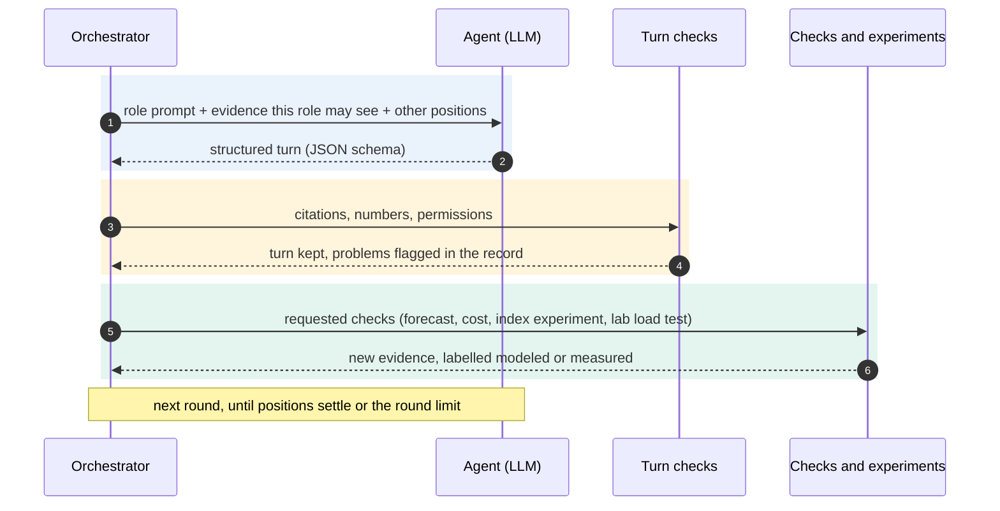

# How a review works

## Tech stack

| Layer | Built with | What it does here |
|---|---|---|
|  | Any LLM: the Anthropic API natively, or any OpenAI-compatible endpoint (OpenAI, Gemini, Mistral, Groq, Ollama, vLLM, LiteLLM) | One call per turn, returning JSON that matches a Pydantic schema. Prompt caching, token counting before each call, effort per role, one retry when a turn is cut off. |
|  | Plain Python, no agent framework | Rounds, what each role may see, checks between rounds, stopping when positions settle, a log that replays. |
|  | Turn validation in code | Citations must exist and be visible to that role. Every number must appear in the evidence it cites. Spend must fit the cap. |
|  | M/M/c queueing model | Utilisation per slot, SLO breach slots, every option scored against the others. |
|  | Cost model, tenant entitlements, cloud pricing APIs | Option costs from a rate card, real prices and month-to-date spend, each tenant's share against what their plan guarantees. |
|  | SQLite, append-only | What a cluster actually does, accumulated: the envelope per hour and weekday, drift detection, and whether the history can carry a decision at all. |
|  | AWS (boto3), Google Cloud and Azure (REST); Floci emulators | Topology, metrics, prices and cost, read-only. A local emulator by default, a real account only with `--live`. |
|  | MySQL 8.0, PostgreSQL 17, SQLite, Percona Toolkit | Real load tests, `performance_schema` and `pg_stat_statements`, `EXPLAIN ANALYZE`, index and rewrite experiments. |
|  | FastAPI, Jinja, SVG charts, argparse | Web UI with password sign-in and a model settings page; every feature also on the command line. |
|  | pytest, ruff, GitHub Actions | The test suite on every push, plus the container and cloud-emulator suites; replay of a full run; a scan for leftover identifiers. |

## The five agents

The short version is in the [README](../README.md#the-five-agents). In full, each agent gets a role, the evidence
that role would normally see, and the checks it may ask for. None of them sees everything.

> [!NOTE]
> Concurrency shows up here as evidence, not as a constraint. Connections are imported, the bottleneck check flags a
> node running near its connection limit, and the lab records threads running, lock waits and deadlocks. What the
> capacity model does **not** yet do is treat `max_connections`, pool size per application pod, or a saturating pool
> as a limit on the options. See the limitations in the [README](../README.md#limitations).

| Agent | Looks at | Can ask for | Reasoning effort |
|---|---|---|:---:|
| 🟦 **Database engineer** | metrics (CPU, **connections**, memory, IOPS), statement digests, plans, schema, table stats, forecast, batch schedule, experiments | top queries, tenant skew, plan review, index experiment, rewrite check, row-estimate check, table growth, bottleneck check, capacity forecast, load attribution, lab load test, redundant-index check | low |
| 🟩 **Application owner** | calendars, releases, batch schedule and history, SLOs, digests, tenant profiles | top queries, batch reschedule check, capacity forecast, cost, load attribution, tenant entitlements | low |
| 🟨 **Reliability engineer** · SRE | metrics (**connection saturation** included), forecast, SLOs, incident and failover history, calendars, batch, experiments | tenant skew, bottleneck check, batch reschedule check, capacity forecast, cost, load attribution, tenant entitlements, lab load test | medium |
| 🟧 **FinOps analyst** | metric summary, forecast, rate card, budget, table stats, experiments | tenant skew, table growth, capacity forecast, cost, load attribution, tenant entitlements | low |
| 🟪 **Tenant representative** | its own profile, calendar and SLOs, and model results with other tenants removed | tenant skew (own share only), capacity forecast, tenant entitlements (its own plan only) | low |

**Why the effort differs.** Reasoning effort is how much the model thinks before it writes a turn: more effort means
longer internal reasoning, more tokens and a higher cost. Four agents mostly read evidence and quote it (digests,
plans, calendars, the rate card, the budget), and extra thinking there tends to produce numbers the model worked out
itself, which the checks then flag. The reliability engineer is the one agent that has to weigh something nobody
measured, such as an unknown failover time against headroom and cost, so it gets more room. `CAPACITYLAB_EFFORT=high`
(or `low`, `medium`) applies one level to every agent instead. The same agents can also run from scripted rules, which
is free, offline and repeatable.

## What you get

| | |
|---|---|
| 📝 **A decision record** | What each agent recommends and why, open disagreements, unanswered challenges, evidence nobody has, and checks that were requested but never ran. |
| 🩺 **Findings before any review** | Whether a node runs out of CPU or is oversized, whether failover has ever been measured, which tables grow in a way that hurts, and which statements one tenant dominates. `capacitylab findings <scenario>` or the scenario page. |
| 🔎 **Why a slot breaches** | Each breaching slot broken down by statement, by tenant and by batch job, so the remedy follows the cause: a job that can move, a statement worth an index or a rewrite, a tenant taking more than they pay for, or load spread evenly, which is the only case where buying capacity is the honest answer. |
| 🧪 **Measurements from a real engine** | A local MySQL 8.0 or PostgreSQL 17 lab runs the scenario's statement mix over many connections and records latency percentiles, lock waits, deadlocks, statement digests and plans, optionally with Percona Toolkit. |
| 💸 **Costs next to the risk** | Every option priced from the scenario's rate card, and each tenant's share of the cluster compared with what it pays for. |
| 📈 **What your cluster actually does** | `history collect` appends each window of metrics to a local store, and `history envelope` reports what every hour of every weekday reaches (typically, at the high end and at worst), weighted towards recent days, with level shifts detected and thin evidence flagged. |
| 📥 **Your own data** | Read database topology, metrics, prices and cost straight from AWS, Google Cloud or Azure, or import slow logs, `performance_schema` digest exports, `EXPLAIN ANALYZE` output, CloudWatch exports and Percona Toolkit reports. |
| 🔁 **Replay** | Every item is labelled observed, forecast, assumption, modeled or measured. Every run is a log you can replay to re-check each result. |

## How a review runs

The diagram of the whole loop is in the [README](../README.md#the-five-agents). What follows is what happens
inside one round.

Each round, every agent receives only the evidence its role gives it, plus the other agents' latest positions and
challenges. It returns a structured turn: a position, claims with cited evidence ids, assumptions, challenges, missing
evidence and requests for checks. The requested checks run between rounds, and their results arrive as new evidence in
the next one. A run stops at the round limit, or earlier when positions stop changing and nothing is left unanswered.

**Evidence labels.** Each item carries one of five labels, with the same colors as the web UI:

| Label | Meaning |
|---|---|
|  | Collected from a system, or scenario data standing in for it |
|  | Projected from stated assumptions |
|  | Stated, not measured (for example the tenant's 5× expectation) |
|  | Output of the capacity or cost model |
|  | Measured by an experiment CapacityLab ran, in the local lab or experiment database |

Each item also records where it came from: scenario data, the local lab, or an imported file.

> [!CAUTION]
> The experiment database and both labs only connect to `localhost` and only to databases named
> `capacitylab_sandbox…`. Percona Toolkit only attaches to containers named `capacitylab-*`. Nothing in CapacityLab
> connects to a cloud account.
