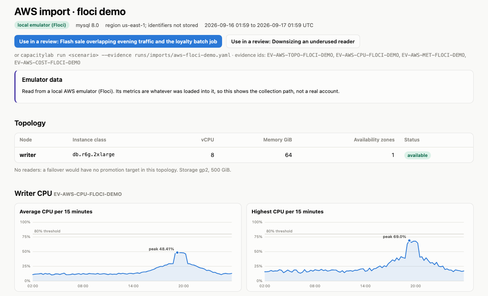

# Bringing your own data

Cloud imports need Docker for the local emulators, or real cloud credentials with `--live`. File imports need
neither.

## Straight from your cloud

CapacityLab reads a managed database straight from AWS, Google Cloud or Azure. Each import talks to a local emulator
by default, and to a real account only with `--live` (or the matching `CAPACITYLAB_*_LIVE` setting in the web UI), using
read calls only. Nothing that identifies the account is stored.

| | AWS | Google Cloud | Azure |
|---|---|---|---|
| **Database** | RDS and Aurora | Cloud SQL | Database for MySQL or PostgreSQL, flexible server |
| **Topology** | ✅ `rds:DescribeDBInstances`, `DescribeDBClusters` | ✅ `sqladmin instances.get` | ✅ `flexibleServers` get and replicas |
| **Metrics** | ✅ CloudWatch | ✅ Cloud Monitoring | ✅ Azure Monitor |
| **On-demand prices** | ✅ Pricing API | ⚪ not read yet (Cloud Billing Catalog) | ✅ public Retail Prices API |
| **Cost this month** | ✅ Cost Explorer | ⚪ needs a BigQuery billing export | ✅ Cost Management |
| **Local emulator** | [Floci](https://github.com/floci-io/floci), port 4566 | [floci-gcp](https://github.com/floci-io/floci-gcp), port 4588 | [floci-az](https://github.com/floci-io/floci-az), port 4577 |
| **Tested** | recorded responses, and against Floci | recorded responses, and against floci-gcp | recorded responses, and against floci-az (MySQL and PostgreSQL) |

The shape of the two commands, for a real account (they need `--live` and the matching extra; to try them without
one, start an emulator first, as below):

```bash
capacitylab import gcp --project my-project --instance orders-primary --label "evening" --out runs/imports/gcp.yaml
capacitylab import azure --subscription <id> --resource-group <group> --instance orders-mysql --db-engine mysql \
  --label "evening" --out runs/imports/azure.yaml
```

> [!NOTE]
> Each import has been run against its emulator, with the evidence fed into a review; the Containers workflow and
> `make check-containers` repeat that on request. All three emulator checks pass; none of the imports has been run
> against a real account. The emulators do not serve everything, and what is missing is skipped with the
> reason written into the evidence:
>
> - **floci-gcp 0.9.0** serves Cloud SQL and Cloud Monitoring, so a GCP import yields topology, the CPU series and
>   metrics. It has no price catalog, and Google Cloud has no cost API outside a BigQuery billing export.
> - **floci-az 0.13.0** serves flexible servers only, so an Azure import yields topology. Replicas, Azure Monitor
>   metrics, prices and cost are skipped; the metrics, price and cost parsing is tested against recorded responses.
>
> `pip install -e ".[gcp]"` or `".[azure]"` adds the credential libraries `--live` needs.

Against the local emulators, which is what CI runs:

```bash
docker compose --profile gcp up -d floci-gcp && python scripts/cloud_emulator_seed.py gcp
capacitylab import gcp --project floci-local --instance demo-pg --label "floci-gcp demo" --out runs/imports/gcp.yaml

docker compose --profile azure up -d floci-az && python scripts/cloud_emulator_seed.py azure
capacitylab import azure --subscription demo-subscription --resource-group capacitylab-demo --instance demo-mysql \
  --label "floci-az demo" --out runs/imports/azure.yaml
```

### AWS in detail

```bash
pip install -e ".[aws]"
docker compose --profile aws up -d floci      # local AWS emulator
python scripts/floci_seed.py                  # a synthetic writer, a replica and a day of metrics
capacitylab import aws --instance demo-writer --label "floci demo" --out runs/imports/aws.yaml
capacitylab run campaign-overlap --evidence runs/imports/aws.yaml
```

`capacitylab import aws` (or the **AWS** page in the web UI) reads one RDS instance and its readers through the AWS APIs
and turns them into evidence the agents can cite:

| Evidence | From | Who sees it |
|---|---|---|
|  writer, readers, instance classes, storage | `rds:DescribeDBInstances`, `rds:DescribeDBClusters` | all but the tenant representative |
|  writer CPU in 15-minute slots | `cloudwatch:GetMetricStatistics` | database and reliability engineers |
|  CPU, connections, memory, IOPS per node | `cloudwatch:GetMetricStatistics` | database and reliability engineers, FinOps |
|  on-demand price per instance-hour for the whole family | `pricing:GetProducts` | FinOps |
|  RDS cost this month so far | `ce:GetCostAndUsage` | FinOps, database and reliability engineers |

By default it talks to [Floci](https://github.com/floci-io/floci), a local AWS emulator, with placeholder
credentials. Floci runs RDS instances as real MySQL containers, which is why its service needs the Docker socket; it
only starts with `--profile aws`. Its metrics are whatever the seed script loaded, so an emulator import shows the
collection path working end to end, not how a real database behaves.

> [!NOTE]
> Against Floci 2.1.0 the import produces topology, the CPU series, metrics and month-to-date cost; CI runs exactly
> this and then a review with the result. Two things only a real account provides: read replicas (Floci does not
> support creating them, so the seeded cluster is a writer only) and RDS prices (Floci's pricing snapshot has no
> `AmazonRDS` products, so `EV-AWS-RATE` is skipped with that reason). Both paths are covered by tests against
> recorded API responses.

> [!CAUTION]
> `--live` reads a real account with your normal AWS credentials. Only the five read calls above are made. Cost
> Explorer bills per request on AWS, so pass `--no-cost` to skip it. No account id, ARN, endpoint, instance or cluster
> name, or tag is stored: nodes become `writer` and `reader-1`, and the import is named by `--label` or a short hash.



When a review has an `EV-AWS-RATE` item attached that covers every instance class the options need, the capacity model
prices the options with those on-demand AWS prices, keeping only the storage rate from the scenario's rate card. If any
class is missing, it keeps the scenario's rate card and says which classes were missing. The scenario and run pages
name the prices they used, and the cost check tells the agents the same.

## What a cluster actually does, accumulated

An import answers "what does this cluster look like right now". Collecting answers "what does this cluster *do*",
which is the question a decision taken before an event depends on.

```bash
capacitylab history collect aws --instance orders-primary --hours 3 --label "evening cluster" --live
capacitylab history status
capacitylab history envelope CL-9F2A41C0B7D3 --metric CPUUtilization --out runs/imports/envelope.yaml
```

`history collect` runs the same read-only path as the import and appends the metrics to a local SQLite file
(`runs/history.db`). Run it from cron every few minutes: writes are idempotent, so an overlapping window adds nothing
and the same collection can run as often as you like. Identities still never land anywhere: a cluster is keyed by an
HMAC of the identifiers under a salt generated in that file, so history accumulates for the right cluster while the
key means nothing outside your machine.

**Missing data is data.** Every collection is recorded with the window it asked for and how much came back, so a
quiet stretch can be told from a stretch nobody collected. `history status` reports the gaps and warns when nothing
has arrived for over an hour, because a collector that died is the alert you want first.

**The envelope, not a forecast.** `history envelope` groups the samples into slots by hour and weekday and reports
what that group reached: typically, at the high end (p95), and at worst. Three things keep it useful on a workload
that changes:

| | |
|---|---|
| **Recency** | samples are weighted by age with a 7-day half-life, so last week counts and last quarter barely does |
| **Drift** | the last 24 h are compared with the baseline before them; once the level has clearly shifted, the envelope is rebuilt with a 1.5-day half-life so recent behaviour dominates. Fast change is detected, not predicted |
| **Thin evidence** | every slot says how many observations and distinct days it rests on, and flags itself when that is too few to lean on |
| **Readiness** | before anything plans on it, the envelope grades itself: `ready`, `provisional`, or `insufficient`, with the reason. Fewer than 7 days has no weekday shape; under half the window covered means the quiet stretches may be gaps in collection; a level shift keeps it provisional; and planning 30 days ahead on 14 days of history reaches further than the evidence does |

Nothing is trained and no future value is predicted; it is descriptive statistics recomputed on read, so every figure
traces back to samples you collected. A capacity decision then sizes for the high end plus headroom, which errs
towards spending money rather than dropping checkouts. Anything *planned* stays outside it: a campaign or release
date beats anything inferred from history, so those remain scenario assumptions that multiply the envelope.

With `--out` the envelope becomes evidence labelled `modeled`, carrying its own caveats, so the agents can cite it in
a review next to the topology and the costs.

## From exported files

```bash
capacitylab import slowlog mysql-slow.log --tenant-map 1=alder,2=birch --out runs/imports/mine.yaml
capacitylab import pt-query-digest digest.json --out runs/imports/mine.yaml
capacitylab run campaign-overlap --evidence runs/imports/mine.yaml
```

| Kind | Input | Notes |
|---|---|---|
| `slowlog` | MySQL slow query log | grouped by fingerprint with literals removed; per-tenant counts by tenant column (`--tenant-map`) or schema (`--schema-map`) |
| `digest` | performance_schema digest export, CSV or JSON | `--window-seconds` for rates |
| `plan` | `EXPLAIN ANALYZE` output | `--fingerprint` names the statement |
| `metrics` | JSON from `aws cloudwatch get-metric-statistics` | `--unit`, `--period` |
| `pt-query-digest` | `pt-query-digest --output json` | statements keep the tool's checksum id (`PT-…`) |
| `pt-duplicate-keys` | `pt-duplicate-key-checker` text | |
| `pt-deadlocks` | `pt-deadlock-logger --tab` | client addresses are dropped |

> [!WARNING]
> Emails and IPv4 addresses are removed on import, and nothing else. Check imported files before sharing a run log.

File names are never stored. They often carry host, customer or person names, and evidence text reaches the model's
context and the run report. An import is named by a short hash of its contents, so the same file always gets the same
id, or by a name you choose: `capacitylab import slowlog peak.log --label "evening peak" --out ...`.
