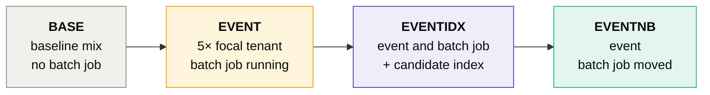

# The local database lab

Needs Docker. Nothing here is required for the offline demo in the README.

```bash
docker compose up -d --wait sandbox-mysql
capacitylab lab run campaign-overlap --duration 60 --qps 300 --out runs/lab/campaign.yaml
capacitylab run campaign-overlap --evidence runs/lab/campaign.yaml --sandbox mysql
```

Or use the **Lab** page in the web UI, which also picks the engine. Each run loads the synthetic retail dataset (122,675 orders, 4,000 customers
across five tenants) into a disposable database and replays the same seeded Poisson arrivals through four phases:



| Collected per phase | MySQL 8.0 | PostgreSQL 17 (`--engine postgres`) |
|---|---|---|
| Client latency p50 / p95 / p99 and queueing delay | the workload driver, per call | the same driver |
| Statement statistics mapped to scenario statements | `performance_schema` digests: rows examined, temporary tables | `pg_stat_statements`: buffer blocks, blocks read from disk |
| Lock waits and deadlocks | `SHOW GLOBAL STATUS`, `INNODB_METRICS` | sampled `pg_stat_activity`, `pg_stat_database` |
| Running sessions and database load | `Threads_running`, sampled | active sessions, sampled |
| Plans with estimated and actual rows | `EXPLAIN ANALYZE` | `EXPLAIN (ANALYZE, BUFFERS, FORMAT JSON)`, with blocks per step |

```bash
pip install -e ".[postgres]"
docker compose up -d --wait sandbox-postgres
capacitylab lab run campaign-overlap --engine postgres --repeats 3 --out runs/lab/campaign-pg.yaml
```

Both engines produce the same evidence ids, so a review can use either file. Percona Toolkit checks apply to the MySQL
lab only.

Percentiles based on fewer than 20 calls are marked *low sample*. With `--sandbox mysql`, roles can also request a
two-phase `lab_load_test` during a review.

## Repeating the phases

```bash
capacitylab lab run campaign-overlap --repeats 3 --out runs/lab/campaign.yaml
```

One pass gives one number per phase, and numbers move between runs. `--repeats N` runs the whole phase set N times,
each pass with its own seed, and adds an `EV-LAB-SPREAD` item with the median, minimum, maximum and range per phase
for statement p95, lock waits, deadlocks and database load. Detailed evidence comes from the first pass, and Percona
checks run only there.

> [!TIP]
> A difference between phases only means something if it is larger than the range within a phase. This is how the
> index question below is meant to be settled.

## Percona Toolkit

```bash
docker pull percona/percona-toolkit
capacitylab lab run campaign-overlap --percona --out runs/lab/campaign-percona.yaml
```

With `--percona` (or the checkbox on the Lab page), each tool runs from the official image in a throwaway container
that shares the lab container's network, so it can reach only the lab server.

| Tool | When | What becomes evidence |
|---|---|---|
| `pt-query-digest` | every phase, on a slow log recorded with `long_query_time=0` | calls, share of query time, p95, rows examined and lock time per statement |
| `pt-duplicate-key-checker` | while the candidate index exists | indexes made redundant (duplicate or left prefix) and their size |
| `pt-deadlock-logger` | after the last phase | the latest deadlock: statements, tables, indexes, lock modes, which transaction was rolled back |
| `pt-variable-advisor`, `pt-mysql-summary` | before the first phase | warnings about server settings, labeled as describing the lab container |


> [!TIP]
> Against the lab, `pt-duplicate-key-checker` reports that the alternative candidate (`tenant_id, customer_id,
> created_day`) makes the existing `idx_orders_tenant_customer` a redundant left prefix (about 1 MiB here), and
> `pt-deadlock-logger` caught a deadlock between a checkout write and the batch job.

> [!NOTE]
> Logging every statement slows all phases a little, so compare phases within a `--percona` run, not against runs
> without it. InnoDB keeps only the latest deadlock, so per-phase deadlock counts come from its own counter. Slow log
> files are deleted from the container after each phase.
