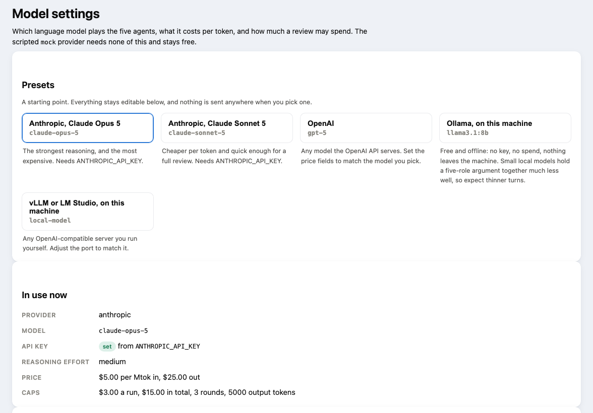

# Using a language model for the agents

CapacityLab is not tied to one model vendor. The agents talk to the model through a small provider interface, and two
providers ship:

| Provider | Reaches | Extras |
|---|---|---|
| `anthropic` | The Anthropic API | Prompt caching of the evidence block, exact token counts before each call, reasoning effort per role |
| `openai` | Any OpenAI-compatible chat completions endpoint: OpenAI, Google Gemini's OpenAI endpoint, Mistral, Groq, DeepSeek, local models through Ollama, vLLM or LM Studio, and Bedrock, Vertex or Azure behind a LiteLLM proxy | JSON schema output, automatic prefix caching where the endpoint offers it, optional `reasoning_effort` |

Both send the same system prompt and evidence, ask for the same turn format, and go through the same checks and spend
limit.

## Choosing one without editing files

The **Model settings** page picks the provider, the model, the endpoint, the per-token prices and the spend caps, and
saves them to `runs/llm-settings.json`. Anything you do not change keeps following the environment. Presets fill the
lot in one click: Claude Opus 5, Claude Sonnet 5, OpenAI, Ollama on this machine, or vLLM and LM Studio.



**No API key is ever stored by the page.** It chooses which environment variable holds the key and shows whether that
variable is set. The key stays in `.env`, which is where the rest of the code looks for it, and the page reports a
local endpoint as needing no key at all.

## Free and offline, with Ollama

```bash
docker compose --profile ollama up -d ollama
docker exec capacitylab-ollama ollama pull llama3.2:3b

# A turn carries the whole evidence bundle, about 6k tokens. Ollama defaults to a 4k window and truncates
# silently, so build a variant with a bigger one:
printf 'FROM llama3.2:3b\nPARAMETER num_ctx 8192\nPARAMETER temperature 0.3\n' > Modelfile
docker cp Modelfile capacitylab-ollama:/tmp/Modelfile
docker exec capacitylab-ollama ollama create capacitylab-llama3.2 -f /tmp/Modelfile

# then pick "Ollama, on this machine" on the Model settings page
```

> [!TIP]
> Size the window to the prompt, not to the maximum. A 3B model at 16k context was killed by Docker's memory limit
> on an 8 GB allowance, while the same model at 8k ran the whole review comfortably. An 8B model needs more memory
> than Docker Desktop usually grants by default.

The endpoint is OpenAI-compatible, so nothing else changes: same prompt, same turn format, same checks, and the
settings page lists the models the server is actually serving. A review costs nothing and nothing leaves the machine.

**What the free models did on this scenario.** A local `qwen2.5:32b` reached a defensible decision for nothing: it
keeps every SLO and finds the root cause, but it buys capacity for the evening where the paid model fixed the workload
instead, and it cited badly 34 times. A 3B model invented an option name, so there was nothing to score. The numbers,
the scoring method and what the runs do and do not show are in
[EVALUATION.md](EVALUATION.md#the-same-test-on-a-free-open-weight-model), not repeated here.

Put keys in `.env` (git-ignored) and set the total you are willing to spend:

```bash
# Anthropic
CAPACITYLAB_PROVIDER=anthropic
CAPACITYLAB_MODEL=claude-sonnet-5
ANTHROPIC_API_KEY=...

# or any OpenAI-compatible endpoint, for example a local model through Ollama
CAPACITYLAB_PROVIDER=openai
CAPACITYLAB_LLM_BASE_URL=http://localhost:11434/v1
CAPACITYLAB_MODEL=capacitylab-llama3.2   # the variant built above
CAPACITYLAB_INPUT_USD_PER_MTOK=0          # prices drive the spend limit; set your vendor's rates
CAPACITYLAB_OUTPUT_USD_PER_MTOK=0

CAPACITYLAB_MAX_USD_TOTAL=10.00
```

```bash
capacitylab run campaign-overlap --max-rounds 3
# or, after a lab run (see LAB.md): --evidence runs/lab/campaign.yaml
capacitylab spend
```

> [!NOTE]
> The recorded real runs used the Anthropic API. The OpenAI-compatible provider is tested against recorded responses
> (request shape, retries, refusals, cached-token pricing, the spend limit), not yet against a live endpoint. Small
> local models may not follow the turn format well; a turn that does not match it fails cleanly and is recorded.

The LLM receives the same evidence and rules as the scripted agents and must return the same structured turn. Spend is
recorded in `runs/spend-ledger.json`.

<table>
<tr>
<th width="50%">✍️ The LLM writes</th>
<th width="50%">⚙️ Code computes</th>
</tr>
<tr>
<td valign="top">

- each agent's position and the reasons for it
- claims, each citing evidence ids
- challenges to other agents
- assumptions it relies on and evidence it is missing
- requests for checks and experiments

</td>
<td valign="top">

- statement digests, query plans, lock waits, deadlocks
- the queueing model and option scoring
- costs and tenant entitlements
- index and rewrite experiments, lab load tests
- the checks on every turn, and the spend limit

</td>
</tr>
</table>

An agent cannot add a measurement, only reason about the ones on the table. A number in a claim that does not appear in
the evidence the claim cites is flagged in the decision record, where the other agents and the reader can see it.

**Reasoning effort, not temperature.** These models take an effort setting rather than a temperature. With
`CAPACITYLAB_EFFORT=auto` (the default) each agent gets the effort shown in [the five agents](HOW-IT-WORKS.md#the-five-agents);
`low`, `medium` or `high` applies one value to every role.

> [!IMPORTANT]
> Before each call, CapacityLab counts the tokens it is about to send and prices the worst case (the full context
> plus the maximum output). If that would cross the per-run or total limit, the run stops first. A turn cut off at the
> output limit is retried once with a request for a shorter answer; both attempts are charged.

Each role's pack is sent in two parts: a first part that only grows by appending (scenario header, then one evidence
item per line, with check results last) and a small second part with this round's state. The first part is marked for
caching, so a later round re-sends only what is new. In a three-round `campaign-overlap` review, 46 to 88% of that block
is unchanged from the role's previous round. Nothing is left out of the pack, since each call starts with no memory of
earlier rounds.

Rough cost of a full review, using the live run's average turn length and the prices in `.env.example`:

| Review of `campaign-overlap` with the lab file | Cost |
|---|---:|
| 2 rounds with Sonnet, production-scale numbers (measured, 2026-09-17) | $2.40 |
| 3 rounds with Sonnet, production-scale numbers (estimated from that run) | about $4 |
| 3 rounds with Sonnet, before the production-scale numbers (measured, 2026-09-16) | $2.28 |

Output is more than half of it, so cost depends on how long the turns are, not on how much evidence is attached. The
production-scale scenario has more options and more money to argue about, and its turns run longer.

## Runs with a real model

Four runs so far on `campaign-overlap` with the lab file attached. The last two use the production-scale numbers
(clusters, options, revenue at risk); the screenshots come from the last one.

| | Opus, 09-15 | Sonnet, 09-16 | Sonnet, 09-17 | Sonnet, 09-17 |
|---|---|---|---|---|
| **Numbers** | small cluster | small cluster | production scale | production scale |
| **Run** |  9 of 15 turns |  15 turns |  9 of 15 turns |  10 turns |
| **Cost** | $1.94 | $2.28 | $2.37 | $2.40 |
| **Outcome of the review** | 3 to 2 split: index and move the batch job, against scale up and move it | all five: move the batch job | four chose, all but one on moving the batch job; the tenant representative never got a round-2 turn | all five: move the batch job |
| **Violations caught** | 8 (plus 3 checker mistakes, since fixed) | 4, all in round 1 | 10 | 6, all in round 2 |

- **The models disagreed about the answer.** Opus split 3 to 2. Sonnet converged twice on moving the batch job: in the
  earlier run its database engineer went to "index and move the batch job" in round 2 and back in round 3; in the
  production-scale run it chose the move in round 1 and the application owner, FinOps analyst and tenant representative
  decided in round 2. Unanimity is not agreement about truth. None of these runs requested an index experiment, so the
  index options show no benefit in their forecasts.
- **Money changed the conversation.** In the production-scale run the agents quote the $304,500 of sale revenue at risk
  if nothing changes, the $18,708.48 season scale-up and the $13,548.80-a-month resize against a $16,500 monthly budget, and
  settle on the $0 option that keeps every SLO in the model.
- **What the checks caught in the production-scale run:** the FinOps analyst quoted the $16,500 budget while citing
  the cost estimate instead of the budget evidence, and worked out a -$18,408.48 headroom itself instead of quoting it;
  the reliability engineer quoted 95% and 5× without citing where they came from. In the stopped run two agents cited
  assumption names as if they were evidence; the prompt now says they are not, and the next run had no invalid
  citations.
- **One turn hit the output limit** and was retried with a request for a shorter turn, which saved the run. Both
  attempts were charged.
- **Round 1 costs almost nothing in input** because the whole pack is written to the cache; rounds 2 and 3 re-send
  only what is new.
